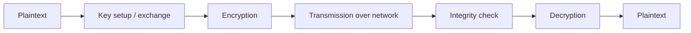
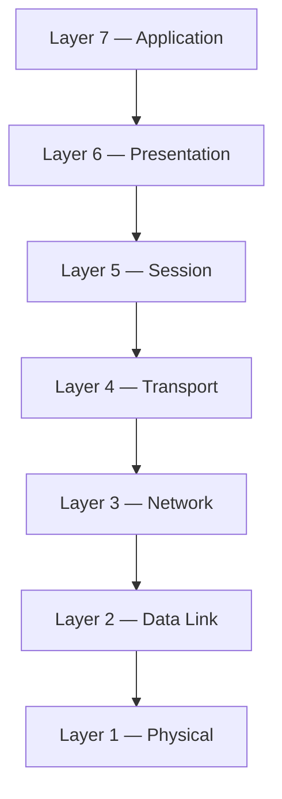
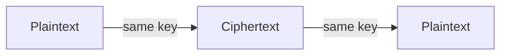
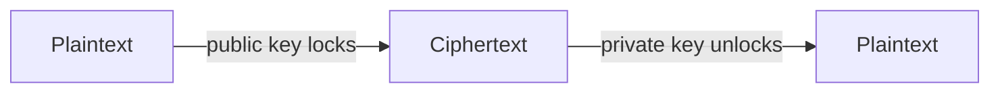
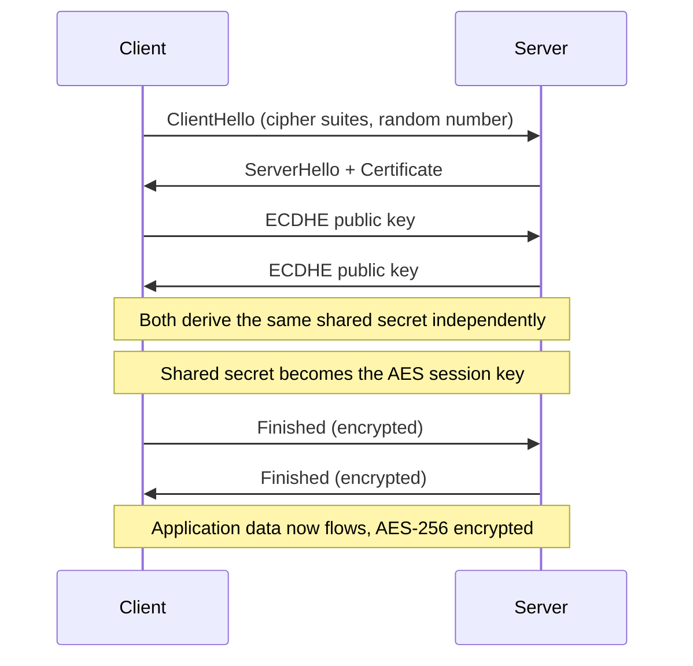

# Cryptography — The Complete Flow

Where a message starts, where it ends, and everything that has to happen in between for it to stay private on a network you don't control.

**Contents**
- [Why Cryptography Exists](#why-cryptography-exists)
- [The Flow: Start to End](#the-flow-start-to-end)
- [OSI Model: Where Security Lives](#osi-model-where-security-lives)
- [Keys: How Many, and How Are They Built](#keys-how-many-and-how-are-they-built)
- [Caesar Cipher Walkthrough](#caesar-cipher-walkthrough)
- [Algorithms](#algorithms)
- [What Each Piece Contributes](#what-each-piece-contributes)
- [Worked Example: TLS 1.3 Handshake](#worked-example-tls-13-handshake)
- [Cryptography in India: What's Next](#cryptography-in-india-whats-next)
- [Glossary](#glossary)

---

## Why Cryptography Exists

Data on a network passes through routers, ISPs, and towers nobody sending the message controls. Cryptography exists to make four guarantees hold anyway:

| Guarantee | Question it answers | Delivered by |
|---|---|---|
| Confidentiality | Can only the right party read this? | Symmetric encryption (AES) |
| Integrity | Was this changed in transit? | Hash functions (SHA-256) |
| Authentication | Am I actually talking to who I think I am? | Asymmetric keys + certificates |
| Non-repudiation | Can the sender deny sending this later? | Digital signatures |

No single algorithm provides all four at once — real systems, like a browser opening an HTTPS site, combine all of them. See [What Each Piece Contributes](#what-each-piece-contributes).

---

## The Flow: Start to End



**1. Plaintext (start)**
The original, readable message — a password, a chat message, a payment instruction. This is the human-meaningful data before cryptography touches it, and the exact form it must return to at the end.

**2. Key setup / exchange**
Before anything is scrambled, both sides need a key. Either a shared symmetric key is negotiated (usually via asymmetric cryptography, as in TLS), or each side already holds a public/private key pair.

**3. Encryption**
An algorithm such as AES transforms plaintext into ciphertext using the key. The same plaintext with a different key produces an unrelated ciphertext — the key, not the algorithm, is the actual secret.

```
ciphertext = AES_256(plaintext, shared_key)
```

**4. Transmission**
Ciphertext travels across the untrusted network. Anyone intercepting it sees only meaningless bytes.

**5. Integrity check**
A hash or MAC travels alongside the ciphertext. The receiver recomputes it — if even one bit changed in transit, the values won't match and the message is rejected before decryption happens.

```
if HMAC(ciphertext) != received_tag: reject()
```

**6. Decryption**
The receiver, holding the matching key, reverses the transformation. Without the correct key this is computationally infeasible — that's the security guarantee.

```
plaintext = AES_256_decrypt(ciphertext, shared_key)
```

**7. Plaintext (end)**
The message arrives back in its original form, reconstructable only by whoever held the right key.

---

## OSI Model: Where Security Lives

Cryptography isn't applied at one single point — each layer of the OSI stack has its own security mechanisms.



| Layer | Name | Security mechanism | What it protects |
|---|---|---|---|
| 7 | Application | HTTPS, PGP, S/MIME, SSH | The user-facing protocol — HTTPS wraps HTTP in TLS, PGP/S-MIME encrypt email content, SSH encrypts remote sessions |
| 6 | Presentation | TLS/SSL, data encoding | Formatting and encryption before data reaches the application |
| 5 | Session | TLS handshake, Kerberos | Where cipher suite negotiation and session key exchange actually happen |
| 4 | Transport | TLS, SSL, DTLS | Encrypts and authenticates the whole connection — the "S" in HTTPS |
| 3 | Network | IPsec, VPN, IKE | Encrypts and authenticates every IP packet — how VPNs tunnel over the public internet |
| 2 | Data Link | WPA2/WPA3, MACsec, 802.1X | Secures data across a single physical link — Wi-Fi, Ethernet |
| 1 | Physical | Hardware/fibre security, QKD | Physical tamper-proofing; Quantum Key Distribution uses photon physics to detect eavesdropping |

---

## Keys: How Many, and How Are They Built?

Every algorithm needs a key — secret data controlling exactly how the scrambling happens. How many keys are needed, and how they're generated, is what splits cryptography into two families.

### Symmetric — one key



**Built how:** a cryptographically secure random number generator (CSPRNG) draws entropy from hardware noise — thermal noise, timing jitter — to produce an unpredictable string of bits, typically 128 or 256 bits.

```
key = CSPRNG(256 bits)  →  3F A1 09 C4 ... (32 bytes)
```

**Used for:** bulk data encryption — it's fast. AES-256 is the current standard: WhatsApp, disk encryption, WPA3.

**Limitation:** both sides need the same key beforehand. Sharing that key safely over an open network is the exact problem asymmetric cryptography solves.

### Asymmetric — two keys



**Built how:**
- **RSA** — pick two large random prime numbers (~1024 bits each) and multiply them. Easy to compute, effectively impossible to reverse.
- **ECC** — a random private number is multiplied by a fixed point on an elliptic curve to get the public key. Same one-way principle, much smaller keys.

```
RSA: n = p × q   (p, q are 1024-bit primes)  →  public key derived from n
```

**Used for:** not bulk data (too slow), but for exchanging the symmetric key safely, and for digital signatures. This is how HTTPS opens every connection — RSA/ECC negotiates a shared AES key, then AES does the heavy lifting.

**Why it works:** the public key can be published to anyone; only the matching private key can undo what it locks.

---

## Caesar Cipher Walkthrough

The ancestor of every algorithm above: shift each letter forward by a fixed number (the key).

```python
def caesar(text, shift, decrypt=False):
    shift = -shift if decrypt else shift
    result = ""
    for ch in text.upper():
        if ch.isalpha():
            result += chr((ord(ch) - 65 + shift) % 26 + 65)
        else:
            result += ch
    return result

plaintext = "MEET ME AT DAWN"
key = 3

ciphertext = caesar(plaintext, key)
recovered  = caesar(ciphertext, key, decrypt=True)

print("Plaintext :", plaintext)   # MEET ME AT DAWN
print("Ciphertext:", ciphertext)  # PHHW PH DW GDZQ
print("Recovered :", recovered)   # MEET ME AT DAWN
```

Modern ciphers work on the same principle — plaintext + key → ciphertext, reversible only with the right key — just with computationally one-way math instead of a simple shift.

---

## Algorithms

### Symmetric ciphers

| Algorithm | Type | Notes | Used in |
|---|---|---|---|
| AES-256 | Block cipher, 256-bit key | Global standard; 128-bit blocks, 14 rounds; very fast in hardware | WhatsApp, BitLocker, WPA3, VPNs |
| ChaCha20 | Stream cipher, 256-bit key | Preferred where AES hardware acceleration isn't available; paired with Poly1305 | TLS 1.3 on mobile, WireGuard |
| DES / 3DES | Block cipher, 56/168-bit key | 1970s design, now broken by brute force; deprecated | Legacy systems only |

### Asymmetric ciphers

| Algorithm | Type | Notes | Used in |
|---|---|---|---|
| RSA-2048/4096 | Public key, prime factorisation | Security rests on the difficulty of factoring large primes; slower than ECC | Certificates, email encryption, code signing |
| ECC | Public key, elliptic curve math | 256-bit ECC ≈ 3072-bit RSA security, much faster | TLS 1.3, crypto wallets, mobile HTTPS |
| Diffie–Hellman / ECDHE | Key exchange | Two parties agree on a shared secret without transmitting it; adds forward secrecy | Every modern TLS handshake |

### Hash functions

| Algorithm | Type | Notes | Used in |
|---|---|---|---|
| SHA-256 | Hash, 256-bit output | Fixed-size fingerprint; one changed input character changes the whole hash | Bitcoin, checksums, salted password storage |
| SHA-3 (Keccak) | Hash, sponge construction | Structurally different from SHA-2; kept as a backup standard | Newer protocol standards |
| bcrypt / Argon2 | Password hashing | Deliberately slow and memory-hard to resist brute force | Login systems |

### Signatures & MACs

| Algorithm | Type | Notes | Used in |
|---|---|---|---|
| RSA / ECDSA signatures | Digital signature | Sender encrypts a message hash with their private key; anyone verifies with the public key | Software updates, SSL certificates, e-signatures |
| HMAC | Keyed-hash MAC | Combines a hash with a secret key — checks integrity and authenticity in one step | API request signing, JWT tokens |

---

## What Each Piece Contributes

| Property | Delivered by | Why |
|---|---|---|
| Confidentiality | Symmetric ciphers (AES) | Keeps content unreadable without the key |
| Integrity | Hash functions (SHA-256) | Any single-bit change produces a different hash |
| Authentication | Asymmetric keys + certificates | Proves identity of the other party |
| Non-repudiation | Digital signatures | Sender can't credibly deny signing it later |

---

## Worked Example: TLS 1.3 Handshake

Everything above, working together in the first fraction of a second of loading a website.



1. **ClientHello** — browser sends supported cipher suites and a random number.
2. **ServerHello + Certificate** — server picks a suite, sends its own random number and its certificate, signed by a trusted Certificate Authority.
3. **ECDHE key exchange** — both sides generate ephemeral key pairs and exchange public keys, each independently computing the same shared secret.
4. **Derive session keys** — the shared secret feeds a key-derivation function that produces the AES session key. This is the handoff from asymmetric to symmetric crypto.
5. **Finished** — both sides send an encrypted hash of the handshake so far, confirming nothing was tampered with.
6. **Application data** — every request and response from here on is AES-256 encrypted and MAC-authenticated.

---

## Cryptography in India: What's Next

India's digital economy — UPI, Aadhaar, DigiLocker, CBDC pilots — now runs entirely on cryptography at national scale, at the same time quantum computers are edging closer to breaking the RSA/ECC math nearly all of it depends on.

**The quantum threat is not hypothetical.** A sufficiently powerful quantum computer running Shor's algorithm could factor RSA's primes and break ECC's curve math. "Harvest now, decrypt later" attacks mean data encrypted today could be exposed once such machines exist.

**Post-Quantum Cryptography migration.** NIST finalized PQC standards (lattice-based CRYSTALS-Kyber and Dilithium) in 2024. India's financial, defence, and Aadhaar-linked systems need a phased migration plan — a multi-year infrastructure project, not a patch.

**Indigenous cryptographic capability.** Depending entirely on foreign-designed algorithms is a strategic risk. C-DAC, DRDO, and academic labs (IISc, IITs) are researching homegrown primitives, but any indigenous algorithm needs years of open cryptanalysis before it can be trusted at scale.

**National Quantum Mission and talent.** India's National Quantum Mission (2023) funds quantum computing and Quantum Key Distribution research. The real bottleneck is people — cryptography at PQC/QKD level is still a small specialist field relative to the scale of systems that need it.

**Policy.** The Digital Personal Data Protection Act (2023) and CERT-In's directions push encryption requirements, but India still lacks a single national cryptographic standards body comparable to NIST in the US.

**Scale of what's at stake.** UPI alone processes billions of transactions a month. Power grids, defence networks, and healthcare data are next in line for mandated encryption — demand for cryptographic engineers will keep outpacing supply.

**Will India get there?** Partly, on a realistic timeline rather than all at once. India has the digital scale and policy momentum to justify serious investment, and early PQC pilots are underway in parts of banking and defence. What's missing is a coordinated national migration timeline, a larger trained workforce, and homegrown algorithms that have survived public scrutiny. None of that is technically impossible — it's a matter of sustained investment over the next five to ten years, not a solved problem or a lost cause.

---

## Glossary

| Term | Meaning |
|---|---|
| Plaintext | The original, readable data before encryption, and after successful decryption |
| Ciphertext | The scrambled output of encryption — should look like random noise without the key |
| Key | Secret data controlling exactly how an algorithm transforms plaintext into ciphertext and back |
| Symmetric vs asymmetric | Symmetric: one shared key, fast, requires safe key sharing. Asymmetric: public/private pair, slower, solves the sharing problem |
| Hash function | A one-way function producing a fixed-size fingerprint of any input; used to detect tampering |
| Digital signature | Cryptographic proof, made with a private key, that a specific person authored a message unchanged |
| Forward secrecy | Even if a private key is stolen later, past sessions using ephemeral keys stay unreadable |
| Post-Quantum Cryptography | Algorithms designed to resist quantum computers, which could otherwise break RSA and ECC |

---

*Plaintext in, plaintext out — everything in between is the point.*
