# Signal Protocol: Complete Guide to Every Key and Metadata Privacy


*Complete flowchart: keys, X3DH, Double Ratchet, encryption, Sealed Sender, groups, calls, and what the server can still see. (A PNG copy is included as `signal_e2ee_flowchart.png`.)*

---

> **Signal Protocol** is a cryptographic protocol (not just an app) that provides end-to-end encryption (E2EE) for messages, calls and media. It is used by the Signal app and, for personal chats, by WhatsApp and other services.
>
> This guide combines two topics:
> 1. **Part A: the protocol architecture** (keys, X3DH, Double Ratchet, message encryption, groups, calls)
> 2. **Part B: metadata minimization** (Sealed Sender, private contact discovery, encrypted profiles, private groups, usernames)
>
> Diagrams are written in **Mermaid** and render on GitHub, GitLab, Obsidian, VS Code (with a Mermaid extension) and Notion.
>
> **Accuracy note:** Signal evolves. Names like X3DH are from the public specification; newer Signal versions add post-quantum protection (PQXDH and a post-quantum ratchet). Where an infographic simplifies something (for example "AES-256-GCM"), this guide points out the difference. For exact current parameters, always check Signal's official documentation.

---

## Table of contents

**Part A: Protocol architecture**
1. [The big picture](#1-the-big-picture)
2. [Quick reference: all key types](#2-quick-reference-all-key-types)
3. [Registration and identity keys](#3-registration-and-identity-keys)
4. [Prekeys (Bob publishes)](#4-prekeys-bob-publishes)
5. [Retrieve and verify keys (Alice)](#5-retrieve-and-verify-keys-alice)
6. [Ephemeral key](#6-ephemeral-key)
7. [X3DH: initial key agreement](#7-x3dh-initial-key-agreement)
8. [Double Ratchet](#8-double-ratchet)
9. [Message encryption](#9-message-encryption)
10. [Delivery and decryption](#10-delivery-and-decryption)
11. [Key lifecycle (device to device)](#11-key-lifecycle-device-to-device)
12. [Group chats: Sender Keys](#12-group-chats-sender-keys)
13. [Calls (voice and video)](#13-calls-voice-and-video)
14. [Multi-device support](#14-multi-device-support)
15. [Backups](#15-backups)

**Part B: Metadata privacy**
16. [Traditional messaging metadata](#16-traditional-messaging-metadata)
17. [Sealed Sender step by step](#17-sealed-sender-step-by-step)
18. [Other metadata-minimization features](#18-other-metadata-minimization-features)
19. [What is minimized vs what cannot be eliminated](#19-what-is-minimized-vs-what-cannot-be-eliminated)

**Part C: Summary**
20. [Security properties explained](#20-security-properties-explained)
21. [Signal vs WhatsApp: how they differ and on what basis](#21-signal-vs-whatsapp-how-they-differ-and-on-what-basis)
22. [Full end-to-end flow (one diagram)](#22-full-end-to-end-flow-one-diagram)
23. [Likely questions and answers](#23-likely-questions-and-answers)

---

# Part A: Protocol architecture

## 1. The big picture

Signal solves four problems and then adds a fifth (metadata):

| Problem | Solution |
|---|---|
| Who is this device? | **Identity keys** (long-term key pair per device) |
| How can Alice start a secure chat when Bob is offline? | **Prekeys** published to the server in advance |
| How do they agree on a secret without sending it? | **X3DH** (Diffie-Hellman based key agreement) |
| How do we keep each message safe, even if a key leaks later? | **Double Ratchet** (a new key for every message) |
| How do we hide who is talking to whom from the server? | **Sealed Sender** and related privacy features |

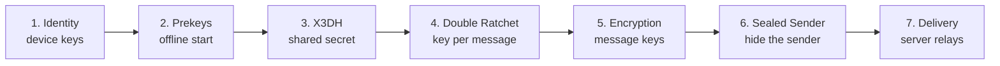

---

## 2. Quick reference: all key types

| Key / term | Short name | Type | Lifetime | Where it lives | Purpose |
|---|---|---|---|---|---|
| Identity key pair | `IK` | Long-term asymmetric (Curve25519; signatures use Ed25519-style XEdDSA) | Until reinstall / re-register | Private: device only. Public: server | Long-term identity of one device; used for authentication |
| Signed prekey | `SPK` | Medium-term asymmetric | Rotated periodically | Private: device. Public + signature: server | Lets others start a session while you are offline; signed by `IK` |
| One-time prekey | `OPK` | Single-use asymmetric | Used once, then discarded | Private: device. Public batch: server | Adds fresh randomness to the first handshake |
| Ephemeral key | `EK` | Short-term asymmetric | One session setup | Sender's device | Forward secrecy for the handshake |
| Shared secret | `SK` | Symmetric | Seeds the ratchet once | Both devices (derived, never sent) | Starting point of the Double Ratchet |
| HKDF / KDF | | Function | n/a | n/a | Turns secrets into well-separated keys |
| Root key | `RK` | Symmetric | Replaced at every DH ratchet step | Both devices | Produces new chain keys |
| Chain key | `CK` | Symmetric | Replaced after every message | Both devices | Produces one message key per message |
| Message key | `MK` | Symmetric | Single message, then deleted | Both devices | Encrypts exactly one message |
| Ratchet key pair | | Asymmetric (DH) | Until next DH ratchet step | Both devices | Injects fresh entropy into the root key |
| Safety number | | Fingerprint (60 digits / QR) | Changes if keys change | Derived on both devices | Manual identity verification |
| Sender Key | | Symmetric chain + signing key | Per member, per group | All group members | Efficient group encryption |
| SRTP master secret | | Symmetric (random 32 bytes) | One call | Caller + callee | Encrypts call media |
| Sender certificate | | Short-lived signed certificate | Short | Sender's device | Proves the sender's identity inside a sealed envelope |
| Delivery token (unidentified access key) | | Symmetric, derived from profile key | Tied to profile key | Sender + recipient | Lets the server accept a sealed message without knowing the sender |
| Profile key | | Symmetric | Until rotated | Own device + trusted contacts | Encrypts name/avatar; seeds delivery token |

---

## 3. Registration and identity keys

User installs Signal and registers with a phone number (usernames can later hide the number from other users). The device generates its keys **locally**.

| Part | Where it goes |
|---|---|
| `IK_priv` | Stays on the device (stored securely). Never sent. |
| `IK_pub` | Uploaded to the Signal server and shared with contacts. |

- The identity key is the cryptographic identity of **one device**, used for authentication.
- It normally never changes, so a change (for example after reinstalling) is visible to your contacts as a changed safety number.

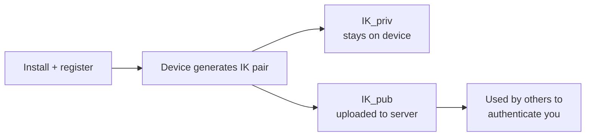

---

## 4. Prekeys (Bob publishes)

For asynchronous messaging, Bob (receiver) uploads a bundle ahead of time:

| Item | Description |
|---|---|
| `IK_B` (public) | Bob's identity key |
| `SPK_B` (public) + signature | Signed prekey; the signature (made with `IK_B`) proves it is Bob's |
| `OPK_B1, OPK_B2, ...` (public) | A batch of one-time prekeys; each is handed out once |

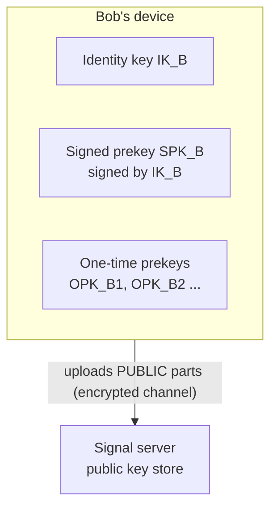

- **SPK** is medium-lived and rotated. The signature stops the server swapping in a fake key.
- **OPK** is used once and then discarded, which gives each first handshake unique entropy. If OPKs run out, the handshake still works (without DH4).

---

## 5. Retrieve and verify keys (Alice)

Alice fetches Bob's **key bundle** from the server.

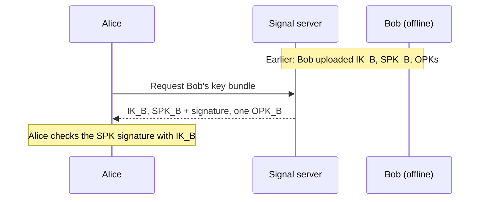

**Verification options (to defeat a malicious server):**

- **Safety number** (60 digits or a QR code): a fingerprint of both identity keys. Compare in person or over another channel. If it matches, nobody swapped keys.
- **Key Transparency** (optional / emerging): an auditable log of public keys, so key substitution is detectable.

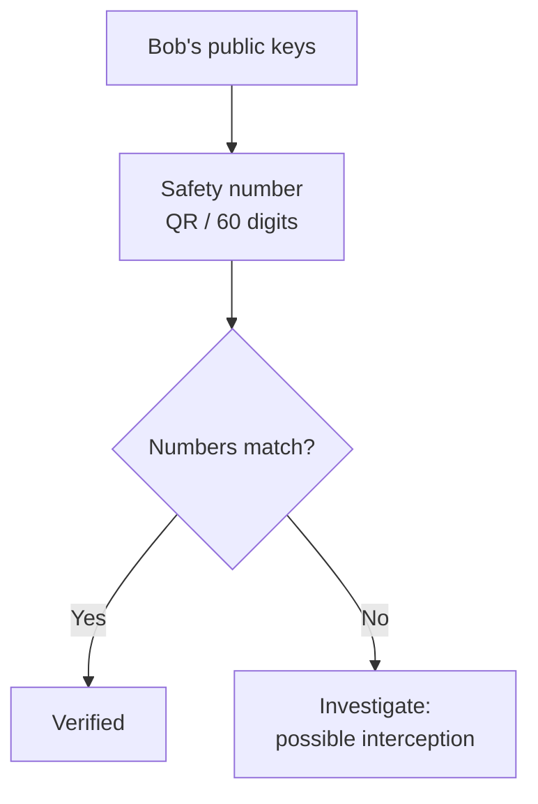

If Bob has several devices, Alice gets a bundle for each one (see [Multi-device](#14-multi-device-support)).

---

## 6. Ephemeral key

Alice creates a fresh, temporary key pair just for this handshake:

```
EK_A = (EK_A_priv, EK_A_pub)
```

- Different from her identity key.
- The private part is deleted after the handshake, so a later leak of her identity key cannot recompute the handshake secret. This gives **forward secrecy** from the very first message.

---

## 7. X3DH: initial key agreement

**X3DH (Extended Triple Diffie-Hellman)** combines Alice's keys and Bob's published keys into a shared secret that is never transmitted.

**Diffie-Hellman in one line:** `DH(a_priv, B_pub) = DH(b_priv, A_pub)`. Both sides compute the same value; an eavesdropper who only sees public keys cannot.

| Name | Formula | What it provides |
|---|---|---|
| DH1 | `DH(IK_A_priv, SPK_B_pub)` | Authenticates Alice |
| DH2 | `DH(EK_A_priv, IK_B_pub)` | Authenticates Bob |
| DH3 | `DH(EK_A_priv, SPK_B_pub)` | Forward secrecy |
| DH4 | `DH(EK_A_priv, OPK_B_pub)` | Extra uniqueness / replay resistance |

```
SK = HKDF( DH1 || DH2 || DH3 || DH4 )
```

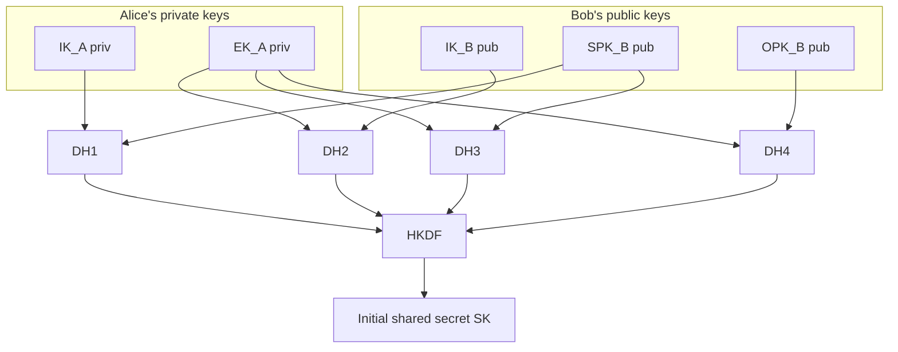

Alice's first message carries (in the clear, since they are public) `IK_A_pub`, `EK_A_pub` and which `OPK` she used. Bob repeats the DH math with his private keys and gets the **same SK**.

> **PQXDH (newer versions):** Signal later added a post-quantum key-encapsulation (KEM) prekey to the handshake, so the shared secret stays safe even against a future quantum computer that recorded today's traffic. The idea is the same; one extra secret is mixed into the HKDF.

---

## 8. Double Ratchet

`SK` is only the **seed**. The Double Ratchet keeps producing new keys so no single key protects many messages.

| Key | Role |
|---|---|
| **Root key (RK)** | Top of the hierarchy; a KDF turns RK + DH output into a new RK and new chain keys |
| **Chain key (CK)** | One for sending, one for receiving; advances each message |
| **Message key (MK)** | Derived from a chain key; encrypts exactly one message |

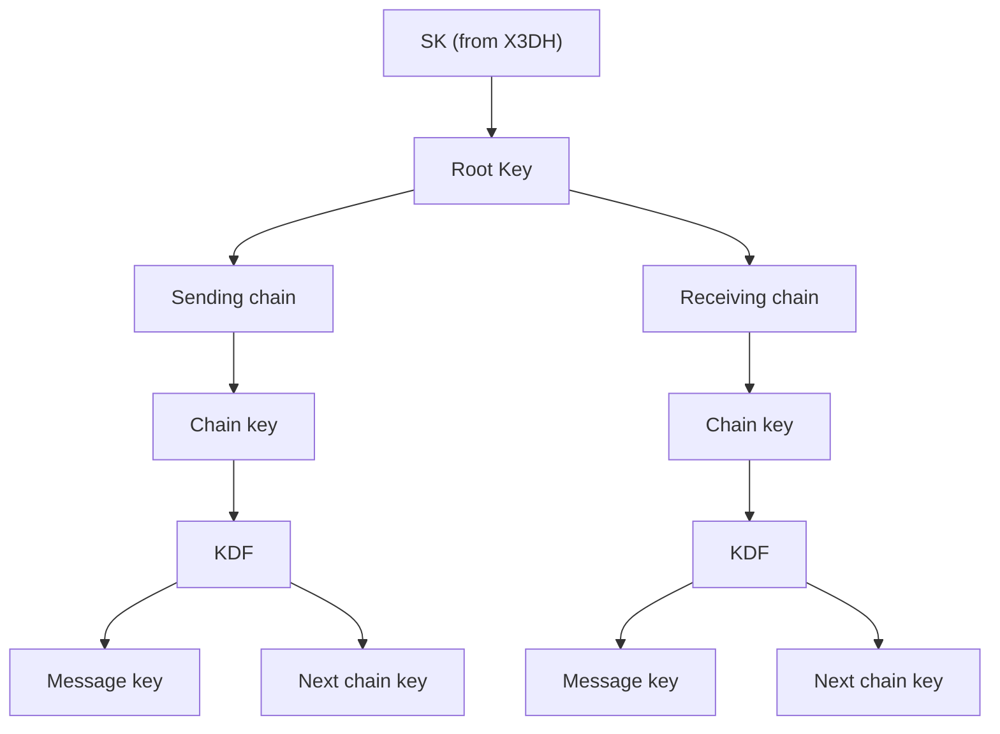

### Symmetric ratchet (every message)

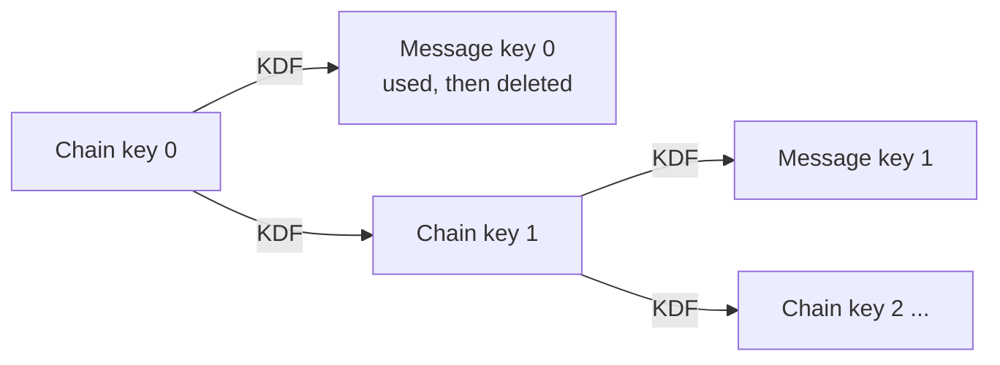

The KDF is one-way, so a stolen chain key cannot be run backwards. **Result: forward secrecy.**

### DH ratchet (when the conversation turns around)

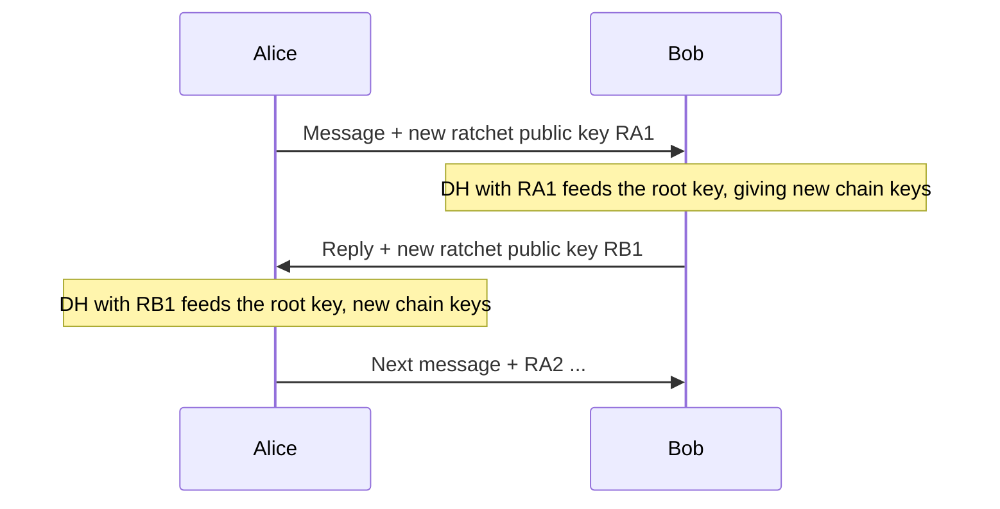

Each reply brings fresh randomness that an attacker who stole old keys does not have. **Result: break-in recovery (post-compromise security).**

> **Post-quantum ratchet (newer versions):** recent Signal releases also add a post-quantum component to the ratchet itself, so ongoing messages (not only the first handshake) resist future quantum attacks.

| Property | Provided by |
|---|---|
| Forward secrecy | Symmetric ratchet + deleting used keys |
| Post-compromise security | DH ratchet |
| Unique key per message | Symmetric ratchet |

---

## 9. Message encryption

The sender takes the current **message key** and encrypts the plaintext, attaching associated data (AAD) such as sender info, counters and protocol context. The associated data is authenticated (tamper-proof) but not hidden.

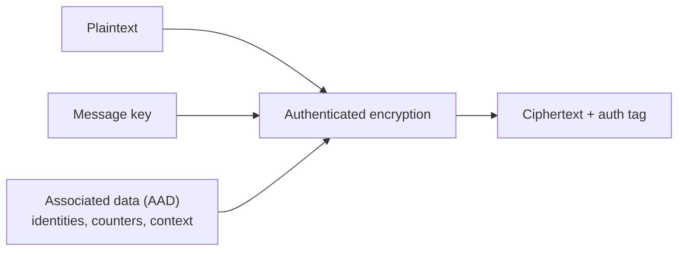

> **Implementation note:** the infographic shows "AEAD (AES-256-GCM)". The Double Ratchet specification describes AEAD abstractly. Signal's reference implementation (libsignal) derives an AES-256 key, a MAC key and an IV from the message key and uses **AES-256-CBC with HMAC-SHA256**. Either way the goal is the same: confidentiality + integrity.

### What the encrypted message contains

| Field | Contents |
|---|---|
| Ciphertext | The encrypted message |
| Ratchet info | Sender's current ratchet public key, message counter, previous chain length |
| Protocol metadata | Version; for a first message also `IK_A`, `EK_A`, OPK id |

---

## 10. Delivery and decryption

The server only forwards. Bob's device reverses the process:

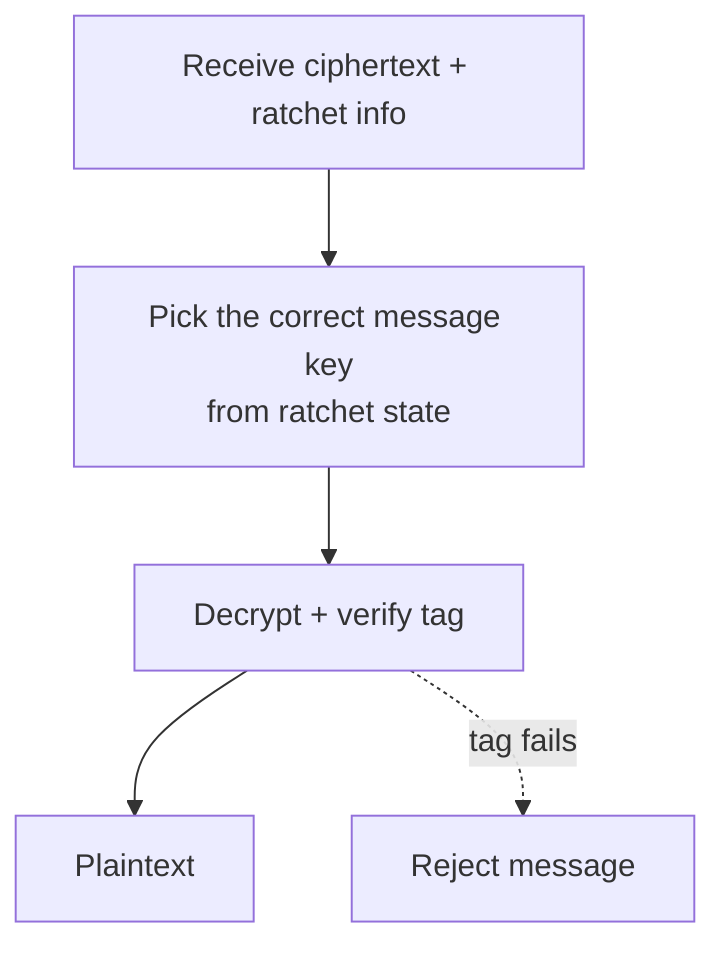

- **Out-of-order messages:** if message 5 arrives before 4, Bob advances his chain, **stores the skipped message keys** temporarily and uses them when message 4 arrives, then deletes them.
- **Integrity:** a modified ciphertext fails the authentication check and is dropped.
- The server never needs, and never has, a decryption key.

---

## 11. Key lifecycle (device to device)

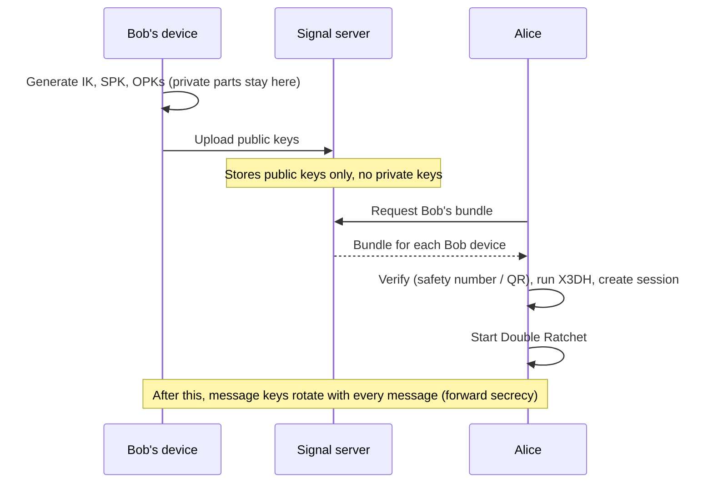

---

## 12. Group chats: Sender Keys

Encrypting separately to every member is slow. Signal uses a **Sender Key** scheme.

1. Alice creates a **Sender Key** for the group (a chain key + a signing key).
2. She sends it to **each member individually** over the normal pairwise encrypted channels (never shared directly in the group).
3. Each member stores Alice's Sender Key.
4. Alice encrypts each group message **once** with a key from her sender chain; everyone decrypts with the stored Sender Key.

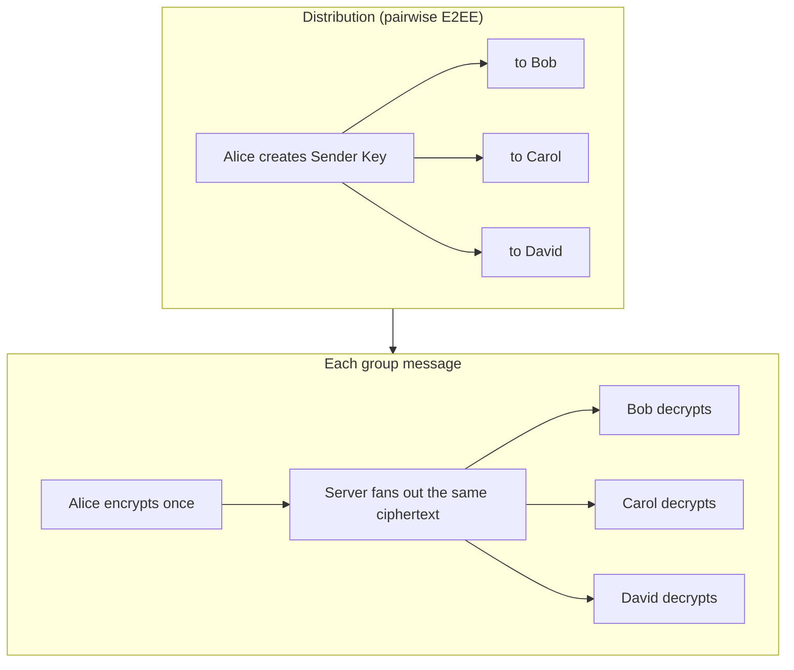

Every member has their own Sender Key per group. When someone leaves, keys are regenerated so they cannot read new messages. Efficient and scalable, but sender chains only ratchet forward (no DH ratchet); the pairwise channels that distribute them do.

---

## 13. Calls (voice and video)

1. The initiator generates a random **32-byte SRTP master secret** for each call.
2. It is sent to the other side **through the E2EE messaging channel**.
3. Media is encrypted with **SRTP** (not through the message ratchet).

SRTP protects: voice, video and screen share.

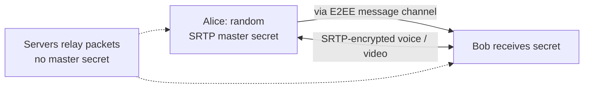

(Group calls use a media relay server; media is still encrypted so the relay cannot read it.)

---

## 14. Multi-device support

- Each device has its **own identity key** and its **own ratchet state**.
- Messaging Bob means: get Bob's device list, establish a session with **each** device, and **encrypt separately for each device** (client-side fan-out).
- Alice's own other devices also receive a copy, encrypted separately.

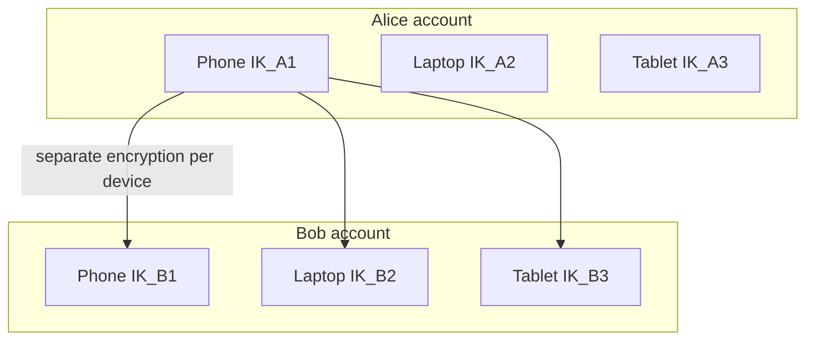

---

## 15. Backups

- Backups are **optional** and separate from live-message E2EE.
- The infographic shows backup keys derived from a user password and stored in the cloud. In practice, **backup options differ by platform and Signal version** (for example local encrypted backups protected by a user-held passphrase/key, and newer optional secure cloud backups). Check Signal's current documentation before relying on a specific design.
- General principle: if a backup is encrypted on-device with a key only you hold, the storage provider cannot read it.

---

# Part B: Metadata privacy

E2EE hides **content**. **Metadata** (who talks to whom, when, from where) can still reveal a lot. Signal's goal is **not to hide all metadata, but to reduce what the service can see**, especially who is communicating with whom.

## 16. Traditional messaging metadata

In a typical messenger, even with E2EE content, the server sees:

| Visible to the server | Example |
|---|---|
| Sender identity / account | Phone number, user ID |
| Recipient / destination | Who the message is sent to |
| Delivery information | Delivered, read, timestamps |
| Timing information | When it was sent / received |
| Network information | IP addresses, device info, location hints |

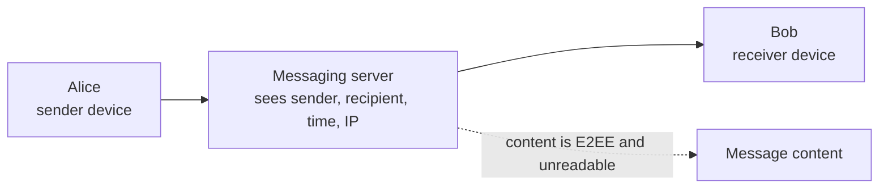

---

## 17. Sealed Sender step by step

**Sealed Sender** hides the sender's identity from the Signal service. The sender's identity travels **inside** the encrypted envelope, readable only by the recipient.

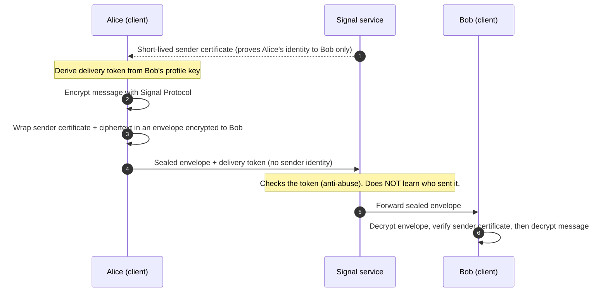

| Step | What happens |
|---|---|
| 1. Service issues sender certificate | A short-lived certificate attesting Alice's identity, without revealing it to others |
| 2. Client derives delivery token | From the recipient's profile key; registered/used so the service can rate-limit abuse without knowing the sender |
| 3. Send message | Normal Signal Protocol ciphertext plus an encrypted envelope containing the sender info |
| 4. Service uses token, not identity | Used for delivery and abuse controls |
| 5. Recipient decrypts and verifies | Decrypts the envelope, checks the certificate locally |

**Layers of the message** (inside to outside):

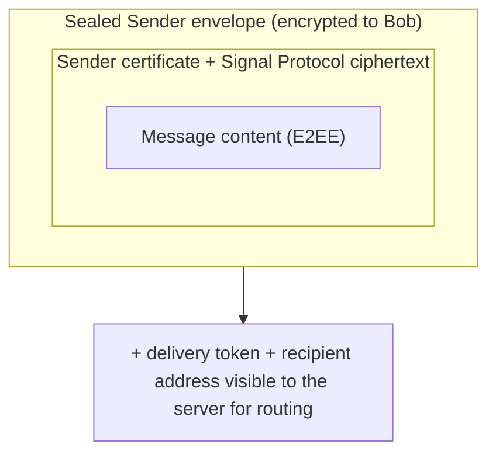

**Limits:** the server still knows the recipient and sees network info (IP address, timing). Sealed Sender is used when the sender can derive the recipient's delivery token (for example when the recipient shares their profile with the sender or allows messages from anyone).

---

## 18. Other metadata-minimization features

| # | Feature | How it protects you |
|---|---|---|
| 1 | **Phone number privacy + usernames** | You can connect with a unique username; your phone number can be hidden from other Signal users. Registration still needs a phone number for the service. |
| 2 | **Private contact discovery** | Your contacts stay on your device. Signal provides a private mechanism (running in protected secure-enclave hardware) to check which contacts use Signal. The service does not receive your raw address book. |
| 3 | **Encrypted profiles** | Profile name and photo are encrypted with a profile key shared only with people you trust. The service cannot read them. |
| 4 | **Private groups** | Group membership and details are designed to remain unavailable to the service (using anonymous credentials, known as zkgroup). |
| 5 | **Disappearing messages** | Processed on the devices. The service is not told that a message is disappearing, or which device processed it. |

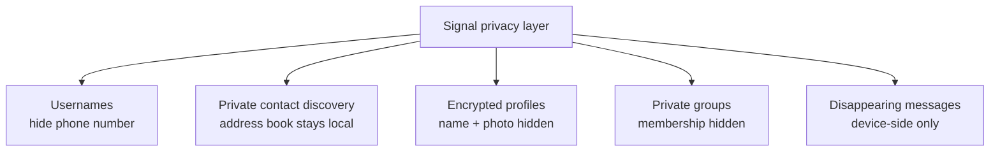

---

## 19. What is minimized vs what cannot be eliminated

| Minimized / protected | Still necessary / potentially observable |
|---|---|
| Message content (E2EE) | Network-level info (IP address, traffic timing, device info) |
| Sender identity to the service (when Sealed Sender applies) | Destination / recipient (needed to deliver) |
| Contacts (private discovery) | Delivery / online status (necessary functionality) |
| Profile contents (encrypted) | Possible traffic-analysis correlation |
| Group information (not exposed) | |
| Phone number exposure to other users (via usernames/privacy settings) | |

### Important distinction

> **Metadata minimization is not zero metadata.** Signal's goal is to minimize what the service learns, not to make network traffic completely invisible.

### End-to-end result table

| Aspect | How Signal handles it | Result |
|---|---|---|
| Message content | E2EE (Signal Protocol) | Server cannot read plaintext |
| Sender identity | Sealed Sender | Service may not learn who sent the message (when applicable) |
| Contacts | Private contact discovery | Service does not receive the raw address book |
| Profile | Encrypted profiles | Service cannot read profile content |
| Phone number | Privacy controls / usernames | Can reduce exposure to other users |

---

# Part C: Summary

## 20. Security properties explained

| Property | Meaning | How it is achieved |
|---|---|---|
| Confidentiality | Only sender and recipient can read content | Message keys the server never has |
| Integrity | Messages cannot be modified undetected | Authentication tag / MAC |
| Authentication | You know who you talk to | Identity keys, signed prekeys, safety numbers |
| Forward secrecy | A stolen key does not expose past messages | Ephemeral keys, one-way KDF chains, key deletion |
| Backward secrecy / break-in recovery | After a compromise, future messages become safe again | DH ratchet adds fresh entropy |
| Asynchronous messaging | Start a chat while the recipient is offline | Prekeys |
| Metadata protection | Minimal data exposed to the service | Sealed Sender, private discovery, encrypted profiles |
| Open source | Auditable by the security community | Public protocol and client code |

---

## 21. Signal vs WhatsApp: how they differ and on what basis

**Short answer:** for the **content of one-to-one messages**, both use the **same cryptographic core** (the Signal Protocol: X3DH, Double Ratchet, Curve25519). The real differences are in **who builds it, how much the service learns about you (metadata), what is open to inspection, and the features around the encryption**.

> Policies and features change often (usernames, backups, key transparency, business features). Treat the rows below as the design and typical behavior as of this guide, and verify current details in each app's official documentation and privacy policy.

### 21.1 Quick comparison table

| Feature | Signal | WhatsApp |
|---|---|---|
| Protocol | Signal Protocol (open standard) | Signal Protocol (custom implementation) |
| Server metadata | Minimal; Sealed Sender; server does not store contacts or group content | More metadata (connected devices, usage, groups) |
| Identity keys | One per device | One per device |
| Prekeys | IK, SPK, OPK | Same concept, custom device management |
| Groups | Sender Keys + private groups | Sender Keys (similar, with extra features) |
| Multi-device | Linked devices | Client-side fan-out, more complex |
| Key verification | Safety numbers + QR | Security code + QR; Key Transparency |
| Open source | Yes | Partially (closed components) |

### 21.2 Detailed comparison, basis by basis

| # | Basis | Signal | WhatsApp | Why it matters |
|---|---|---|---|---|
| 1 | **Who runs it / business model** | Non-profit (Signal Foundation). Funded by donations and grants. No advertising. | Owned by Meta, a for-profit company. Business messaging and the wider Meta ecosystem are part of the business. | The incentive to collect or use data differs, even if content is encrypted in both. |
| 2 | **Message-content encryption** | Signal Protocol (X3DH/PQXDH + Double Ratchet) | Signal Protocol, adopted by WhatsApp and rolled out to all chats in 2016 | **Same strength for content.** Neither company can read 1-to-1 message text. |
| 3 | **Source code and auditability** | Clients, protocol libraries and server code are open source; anyone can inspect and build them | Client and server are closed source. The protocol is described in a published whitepaper, but the production app cannot be fully audited by outsiders | Open code lets the community verify claims instead of trusting the company. |
| 4 | **Metadata the service keeps** | Designed to keep almost nothing: essentially account creation and last-connection information, not who you talk to | Collects more: phone number, profile info, device and connection info, usage and group information, according to its privacy policy | Metadata reveals who you talk to, when and how often, even without reading messages. |
| 5 | **Sender hiding (Sealed Sender)** | Yes, the sender identity is hidden from the service when Sealed Sender applies | No publicly documented equivalent; the service knows both sender and recipient for routing | Signal's server may not learn who sent a message; WhatsApp's does. |
| 6 | **Contact discovery** | Private contact discovery: address book stays on the device; lookup runs in protected secure-enclave hardware so the service does not receive the raw address book | Uses your phone contacts to find who is on WhatsApp, which involves matching your contact numbers on its servers | Your address book is a social graph. Not uploading it is a big privacy gain. |
| 7 | **Identity / phone number** | Phone number needed to register, but **usernames** let you connect without sharing your number | Phone number is the identity; username-style features have been introduced or tested more recently, so check the current status | Sharing a phone number exposes you to others who have it. |
| 8 | **Groups** | Group membership and details designed to be unavailable to the service (anonymous credentials, zkgroup). Messages use Sender Keys | Messages use Sender Keys (same idea), but the service needs to know group membership to deliver and manage groups | Who is in which group is sensitive metadata. |
| 9 | **Profiles** | Name and photo encrypted with a profile key shared with trusted contacts; service cannot read them | Profile info is visible according to your privacy settings | Encrypted profiles keep identity details from the service. |
| 10 | **Key verification** | Safety numbers (60 digits / QR) | Security code (60 digits / QR) plus **Key Transparency** (an auditable log that helps detect silently swapped keys) | Both defend against a malicious server swapping keys; the methods differ. |
| 11 | **Backups** | Cloud chat backup was historically not offered by default; options (local encrypted backups, newer optional secure backups) depend on platform and version | Cloud backups (Google Drive / iCloud) are common. They are **not** protected by the message E2EE by default; an **optional** encrypted backup uses a password or 64-digit key | An unencrypted backup can defeat E2EE: someone with access to the backup could read the chats. |
| 12 | **Multi-device** | Each linked device has its own identity key and ratchet; messages encrypted per device | Same idea (client-side fan-out), added later and more complex because of the larger feature set | More devices means more keys to manage and more places a message can be read. |
| 13 | **Business / extra features** | Focused on private messaging; minimal extra services | Includes business accounts and business messaging, payments in some regions and other services. Some business chats are handled by business tools or by Meta-hosted infrastructure and are not private in the same way as a person-to-person chat | More features and integrations mean more data flows beyond simple 1-to-1 E2EE. |
| 14 | **Reporting messages** | Limited, privacy-first approach | When you report a chat, recent messages from it are sent to WhatsApp for review (a user-initiated exception to "nobody else reads it") | The recipient can choose to share a message; E2EE protects against third parties, not against the recipient. |
| 15 | **Closed vs open ecosystem** | Independent, community-reviewed, small team | Very large user base (billions), strong network effect, but dependent on Meta's policies | WhatsApp's reach is a strength; Signal's independence is a privacy strength. |

### 21.3 What each server can see

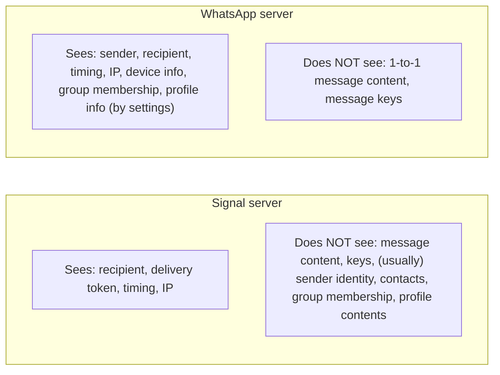

### 21.4 Same core, different layers

```mermaid
flowchart TB
    subgraph SAME["Same in both: content encryption"]
        K1["Identity keys + prekeys"]
        K2["X3DH key agreement"]
        K3["Double Ratchet: forward secrecy + break-in recovery"]
        K4["Message keys encrypt each message"]
    end
    subgraph SIGD["Signal adds: metadata minimization"]
        D1["Sealed Sender"]
        D2["Private contact discovery"]
        D3["Encrypted profiles + private groups"]
        D4["Usernames"]
        D5["Open source everything"]
    end
    subgraph WAD["WhatsApp adds: scale and features"]
        E1["Large-scale multi-device"]
        E2["Key Transparency verification"]
        E3["Optional E2EE cloud backup"]
        E4["Business and other services"]
    end
    SAME --> SIGD
    SAME --> WAD
```

### 21.5 Which should you pick?

| If you care most about... | Better fit |
|---|---|
| Minimum metadata, hiding your contacts and phone number, open source | **Signal** |
| Reaching almost everyone you know (huge user base), rich features | **WhatsApp** |
| Strong content encryption for 1-to-1 chats | **Both** (same protocol) |

**One-line viva answer:** *"Both encrypt message content with the same Signal Protocol, so content is equally protected. Signal differs by being non-profit and fully open source and by minimizing metadata with Sealed Sender, private contact discovery, encrypted profiles and private groups; WhatsApp is owned by Meta, partly closed source, and collects more metadata, but offers larger scale, Key Transparency and optional encrypted backups."*

---

## 22. Full end-to-end flow (one diagram)

```mermaid
sequenceDiagram
    autonumber
    participant A as Alice
    participant S as Signal server
    participant B as Bob

    Note over B: Registration: generates IK_B, SPK_B (signed), OPKs
    B->>S: Upload PUBLIC keys
    A->>S: Request Bob's key bundle
    S-->>A: IK_B, SPK_B + signature, OPK_B
    Note over A: Verify signature, optionally verify safety number
    Note over A: Generate ephemeral key EK_A
    Note over A: X3DH: DH1..DH4, SK = HKDF(...)
    Note over A: SK seeds Root Key, Chain Key, Message Key
    Note over A: Encrypt message with Message Key
    Note over A: Sealed Sender: wrap sender certificate + ciphertext for Bob
    A->>S: Sealed envelope + delivery token (sender hidden)
    S->>B: Forward (server cannot read, does not learn the sender)
    Note over B: Decrypt envelope, verify certificate
    Note over B: Same X3DH, derive same SK, same Message Key, decrypt
    Note over B: Plaintext
    B->>S: Reply with new ratchet public key
    S->>A: Forward
    Note over A,B: DH ratchet: new Root Key and Chain Keys. Cycle continues.
```

---

## 23. Likely questions and answers

**Q1. Is Signal Protocol the same as the Signal app?**
No. Signal Protocol is the cryptographic protocol. The Signal app uses it; so do WhatsApp (personal chats) and other services.

**Q2. Does the Signal server ever have keys to read my messages?**
No. It stores public keys and relays ciphertext. Private keys, chain keys and message keys exist only on devices.

**Q3. Why identity keys and ephemeral keys?**
Identity keys prove who each party is. Ephemeral keys make each handshake unique and give forward secrecy. X3DH mixes both.

**Q4. What are one-time prekeys for?**
Single-use randomness for the first handshake, which helps against replay. Each is discarded after use.

**Q5. Difference between root, chain and message keys?**
Root key: top-level, updated by DH ratchet steps. Chain key: advances once per message. Message key: used for exactly one message and deleted.

**Q6. What is forward secrecy? What is break-in recovery?**
Forward secrecy: stealing today's key does not reveal past messages (one-way KDF + deleted keys). Break-in recovery: after a temporary compromise, the next DH ratchet step makes future messages safe again.

**Q7. How do group chats stay efficient?**
Sender Keys: each member shares a key over pairwise E2EE channels; group messages are encrypted once and fanned out.

**Q8. How are calls encrypted?**
A random 32-byte SRTP master secret is sent over the E2EE message channel; media is encrypted with SRTP.

**Q9. What does Sealed Sender do?**
It hides the sender's identity from the Signal service. The identity (a sender certificate) travels inside the encrypted envelope; the service routes using a delivery token and the recipient address.

**Q10. What is the delivery token for?**
It lets the service apply delivery and abuse controls without seeing the sender's identity. It is derived from the recipient's profile key.

**Q11. How does Signal protect my contacts?**
Contacts stay on your device. A private discovery mechanism checks which contacts use Signal without the service receiving your raw address book.

**Q12. Does Signal hide all metadata?**
No. Network info (IP, timing), the recipient, and delivery status remain observable to the service. Metadata minimization is not zero metadata.

**Q13. How is Signal different from WhatsApp?**
Same encryption protocol for messages. Signal minimizes metadata and is fully open source; WhatsApp collects more metadata and has closed components.

**Q14. Is it quantum-safe?**
Newer Signal versions add post-quantum protection to the initial handshake (PQXDH) and to the ratchet. Older descriptions (X3DH only, as in many diagrams) predate this.

---

**Q15. On what basis does Signal differ from WhatsApp?**
Content encryption is the same (Signal Protocol). The differences are organization (non-profit vs Meta), source code (fully open vs partly closed), metadata (minimal and Sealed Sender vs more collected), contact discovery, groups and profiles privacy, usernames, and backup/business features. See section 21.

---

*Signal: stronger privacy, less data, more control. Not just an app: a protocol for private communication.*
