# WhatsApp End-to-End Encryption: Complete Guide to Every Key


*Complete flowchart: registration, keys, X3DH, Double Ratchet, encryption, delivery and decryption. (A PNG copy is included as `whatsapp_e2ee_flowchart.png`.)*

---

> WhatsApp uses the **Signal Protocol** for end-to-end encryption (E2EE). This guide explains every key, where it lives, what it does, and how the whole flow fits together, from registration to decryption.
>
> Diagrams are written in **Mermaid**. They render automatically in GitHub, GitLab, Obsidian, VS Code (with a Mermaid extension), Notion and most Markdown viewers.
>
> Note: the Signal Protocol is public, but WhatsApp's production implementation has proprietary parts (multi-device, backups, client-side details). Algorithm names below follow the public Signal specification and libsignal; treat exact parameters as "how the protocol is designed" rather than a statement about WhatsApp's internal code.

---

## Table of contents

1. [The big picture](#1-the-big-picture)
2. [Quick reference: all key types](#2-quick-reference-all-key-types)
3. [Step 1: Registration](#3-step-1-registration)
4. [Step 2: Identity keys](#4-step-2-identity-keys)
5. [Step 3: Prekeys (Bob publishes)](#5-step-3-prekeys-bob-publishes)
6. [Step 4: Alice requests Bob's keys](#6-step-4-alice-requests-bobs-keys)
7. [Step 5: Key verification and Key Transparency](#7-step-5-key-verification-and-key-transparency)
8. [Step 6: Ephemeral key](#8-step-6-ephemeral-key)
9. [Step 7: X3DH, the initial key agreement](#9-step-7-x3dh-the-initial-key-agreement)
10. [Step 8: The Double Ratchet begins](#10-step-8-the-double-ratchet-begins)
11. [Step 9: Symmetric ratchet and DH ratchet](#11-step-9-symmetric-ratchet-and-dh-ratchet)
12. [Step 10: Message encryption](#12-step-10-message-encryption)
13. [Step 11: The server's role](#13-step-11-the-servers-role)
14. [Step 12: Recipient decryption](#14-step-12-recipient-decryption)
15. [Group chats: Sender Keys](#15-group-chats-sender-keys)
16. [Media files](#16-media-files)
17. [Calls](#17-calls)
18. [Encrypted backups](#18-encrypted-backups)
19. [Security properties explained](#19-security-properties-explained)
20. [What the server and attackers can and cannot see](#20-what-the-server-and-attackers-can-and-cannot-see)
21. [Full end-to-end flow (one diagram)](#21-full-end-to-end-flow-one-diagram)
22. [The 6 layers: viva / exam summary](#22-the-6-layers-viva--exam-summary)
23. [Likely questions and answers](#23-likely-questions-and-answers)

---

## 1. The big picture

E2EE means only the **sender's device** and the **recipient's device** can read a message. WhatsApp's servers carry the message but never hold the keys to decrypt it.

To achieve this, the protocol solves four problems:

| Problem | Solution |
|---|---|
| How do two devices prove who they are? | **Identity keys** (long-term key pairs) |
| How can Alice start a secure chat when Bob is offline? | **Prekeys** published to the server in advance |
| How do they agree on a secret without ever sending it? | **X3DH** (Diffie-Hellman key agreement) |
| How do we keep each message safe even if a key leaks later? | **Double Ratchet** (new key per message) |

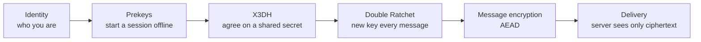

---

## 2. Quick reference: all key types

| Key / term | Short name | Type | Lifetime | Where it lives | Purpose |
|---|---|---|---|---|---|
| Identity key pair | `IK` | Long-term asymmetric | Until reinstall / re-register | Private: device only. Public: server | Long-term identity of one device |
| Signed prekey | `SPK` | Medium-term asymmetric | Rotated periodically | Private: device. Public + signature: server | Lets others start a session while you are offline; signature proves it belongs to you |
| One-time prekey | `OPK` | Single-use asymmetric | Used once, then deleted | Private: device. Public batch: server | Adds fresh randomness to the first handshake |
| Ephemeral key | `EK` | Short-term asymmetric | One session setup | Sender's device | Gives the handshake forward secrecy |
| Shared secret | `SK` | Symmetric (32 bytes) | Used once to seed the ratchet | Both devices (derived, never sent) | Starting secret for the Double Ratchet |
| KDF / HKDF | | Function | n/a | n/a | Turns secrets into well-separated keys |
| Root key | `RK` | Symmetric | Replaced at every DH ratchet step | Both devices | Feeds the ratchet; produces new chain keys |
| Chain key | `CK` | Symmetric | Replaced after every message | Both devices | Generates one message key per message |
| Message key | `MK` | Symmetric | Used for exactly one message, then deleted | Both devices | Actually encrypts one message |
| Ratchet key pair | | Asymmetric (DH) | Until next DH ratchet step | Both devices | Injects new entropy into the Root Key |
| Sender Key | | Symmetric chain + signing key | Per group member, per group | All group members | Efficient group encryption |
| Media encryption key | | Symmetric (random) | One file | Sender, then inside the message to receiver | Encrypts photo/video/file before upload |
| SRTP master secret | | Symmetric (32 bytes) | One call | Caller + callee | Encrypts call audio/video |
| Backup encryption key | | Symmetric | Until backup reset | User-controlled (password or 64-digit key) | Encrypts chat backup in cloud |

---

## 3. Step 1: Registration

When Alice installs WhatsApp and registers her phone number, her device generates its cryptographic keys **locally**. The private parts never leave the phone.

Each device gets its own identity key. That matters for multi-device: Alice's phone, laptop and tablet each have a different identity key.

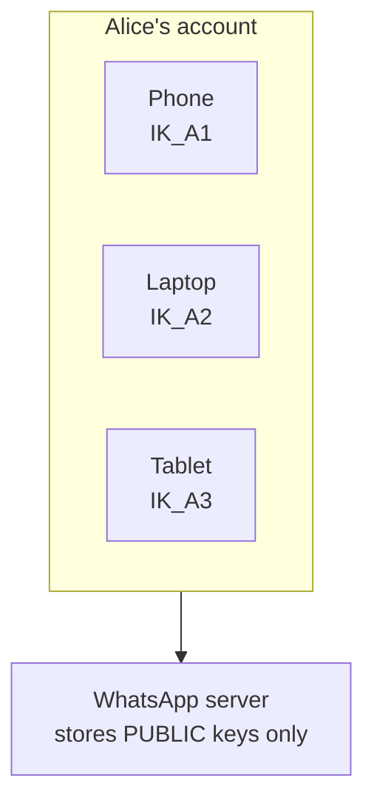

Key points:

- Registration is tied to a phone number, verified by SMS or call.
- Every linked device is an independent cryptographic endpoint.
- The same applies to Bob (`B1`, `B2`, ...).

---

## 4. Step 2: Identity keys

Each device creates one long-term **identity key pair**.

| Part | Name | Where it goes |
|---|---|---|
| Private | `IK_private` | Stays on the device. Never sent anywhere. |
| Public | `IK_public` | Uploaded to the server so others can fetch it. |

For the two users:

```
IK_A = (IK_A_private, IK_A_public)
IK_B = (IK_B_private, IK_B_public)
```

**Why it exists:** the identity key is the cryptographic "name" of a device. It is used in the key agreement (so the shared secret is bound to both identities) and in verification (security codes).

**What happens if it changes?** If Bob reinstalls WhatsApp, his identity key changes. Alice's app notices the change and can show "security code changed". That is the signal to re-verify.

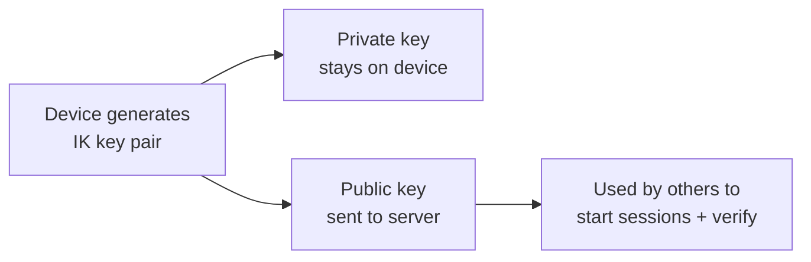

---

## 5. Step 3: Prekeys (Bob publishes)

Real-time key exchange would require both people to be online. **Prekeys** solve this: Bob uploads a bundle of public key material ahead of time so Alice can create a secure session even while Bob is offline.

Bob's published bundle:

| Item | Description |
|---|---|
| `IK_B` (public) | Bob's identity key |
| `SPK_B` (public) + signature | Signed prekey. Bob signs it with his identity key so Alice can check it is genuine |
| `OPK_B1, OPK_B2, OPK_B3, ...` | A batch of one-time prekeys. Each can be consumed by one new session |

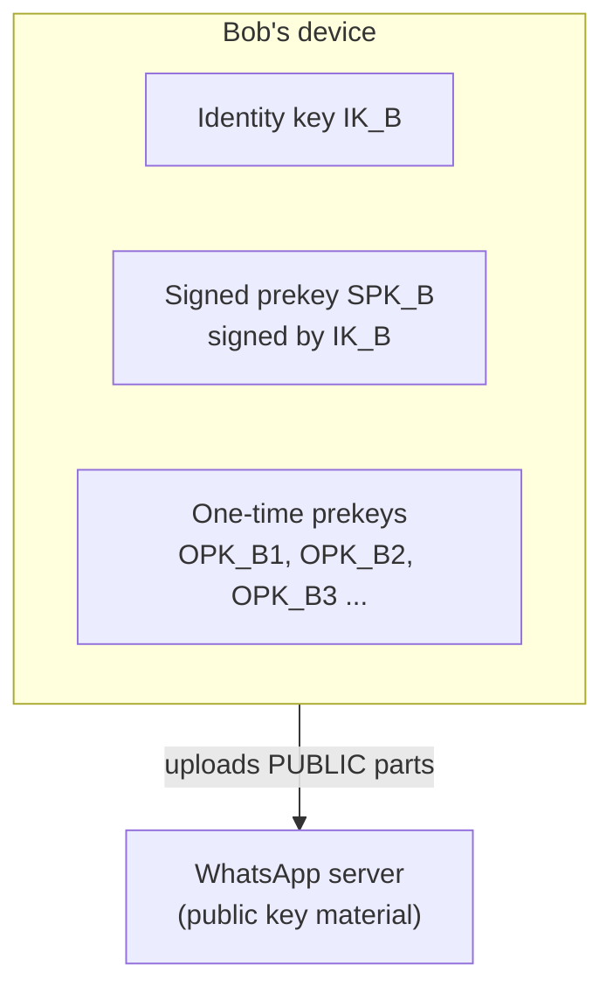

Why each key exists:

- **Signed prekey (SPK):** medium-lived. Because it is signed by the identity key, Alice can trust it really came from Bob and not from the server tampering with it.
- **One-time prekey (OPK):** the server hands out each one only once, then it is deleted from both server and Bob's device after use. This gives every first handshake unique entropy. If OPKs run out, the handshake still works without them (slightly weaker, still secure).

---

## 6. Step 4: Alice requests Bob's keys

When Alice messages Bob for the first time, her device asks the server for Bob's **key bundle**.

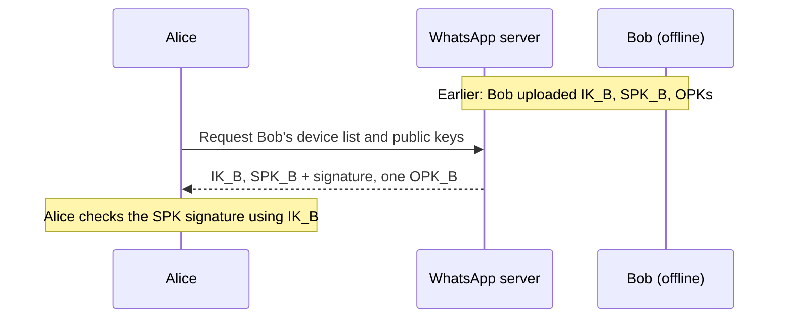

**Multi-device is client-side fan-out.** If Bob has three devices, Alice receives a bundle for each and **encrypts the message separately for each device**. The server never merges them or re-encrypts.

---

## 7. Step 5: Key verification and Key Transparency

How does Alice know the keys really belong to Bob and the server did not swap them (a man-in-the-middle attack)? Two mechanisms:

### Security code (manual verification)

- Both people can compare a **security code** (a 60-digit number or QR code).
- It is a fingerprint derived from both users' identity keys.
- If the codes match (in person or via another channel), no one is intercepting.

### Key Transparency (automatic detection)

- An **auditable directory** of public keys. Changes are recorded in a publicly verifiable log.
- Clients can check that the key the server gives them matches what the log says.
- It makes silent key substitution by the server hard to hide.

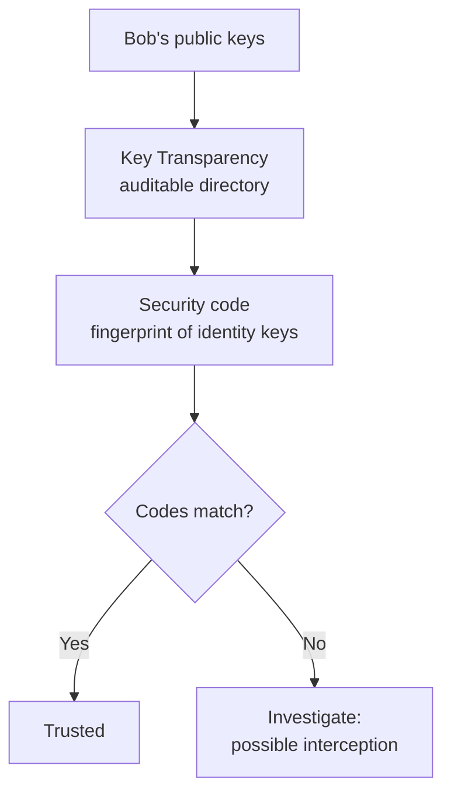

Verification is **optional** for the user, but it is the only defense against a compromised or malicious server that serves fake keys on first contact.

---

## 8. Step 6: Ephemeral key

Alice creates a fresh, temporary key pair just for this session setup:

```
EK_A = (EK_A_private, EK_A_public)
```

- It is **not** the same as her identity key.
- It exists only so the handshake produces a secret that is unique to this session.
- After the handshake, the private part is deleted, so even if Alice's identity key leaks later, past session setups cannot be recomputed. This gives **forward secrecy** at the start of the conversation.

After this step:

| Alice has | Bob has |
|---|---|
| `IK_A` + `EK_A` | `IK_B` + `SPK_B` + `OPK_B` |

---

## 9. Step 7: X3DH, the initial key agreement

**X3DH = Extended Triple Diffie-Hellman.** Alice combines her keys with Bob's published keys to compute a shared secret. She never sends the secret.

### Diffie-Hellman in one sentence

If Alice has private key `a` and public key `A`, and Bob has `b` and `B`, then `DH(a, B) = DH(b, A)`. Both sides compute the same value, but an eavesdropper who sees only `A` and `B` cannot.

### The four DH calculations (when an OPK is available)

| Name | Formula | What it binds |
|---|---|---|
| DH1 | `DH(IK_A_private, SPK_B_public)` | Alice's identity to Bob's signed prekey (authenticates Alice) |
| DH2 | `DH(EK_A_private, IK_B_public)` | Alice's ephemeral to Bob's identity (authenticates Bob) |
| DH3 | `DH(EK_A_private, SPK_B_public)` | Ephemeral to signed prekey (forward secrecy) |
| DH4 | `DH(EK_A_private, OPK_B_public)` | Ephemeral to one-time prekey (extra uniqueness, replay protection) |

Then:

```
SK = KDF( DH1 || DH2 || DH3 || DH4 )
```

(`||` means concatenation. If no OPK is available, DH4 is skipped.)

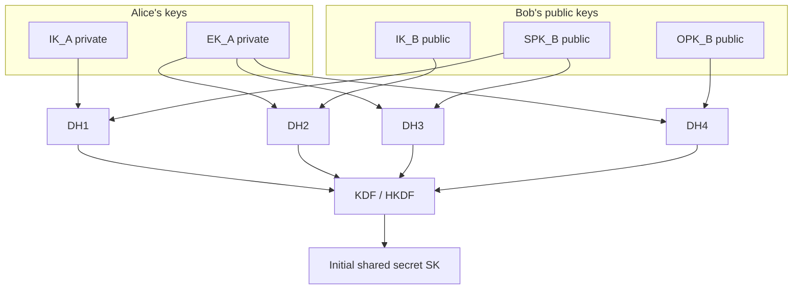

### What Alice sends to Bob

Alice's first message includes (in the clear, because they are public): her `IK_A` public, her `EK_A` public, and which `OPK` she used. Bob uses his private keys to repeat the same four DH operations and gets the **same SK**.

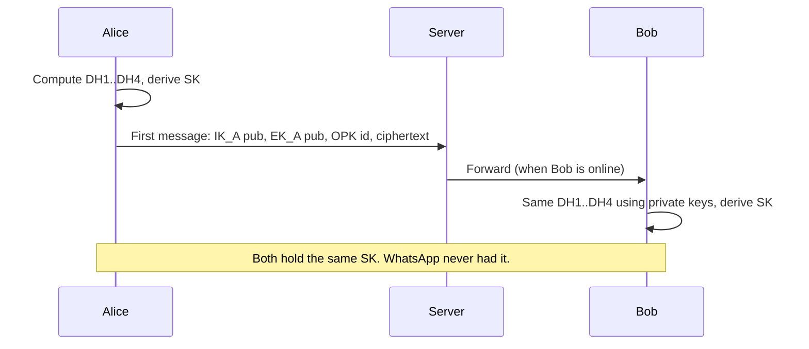

---

## 10. Step 8: The Double Ratchet begins

`SK` is only the **starting point**. It seeds the **Double Ratchet**, which keeps generating new keys so no single key protects many messages.

The Double Ratchet has three kinds of keys:

| Key | Role |
|---|---|
| **Root key (RK)** | Top of the hierarchy. A KDF takes the root key plus a DH output and produces a new root key and a new chain key. |
| **Chain key (CK)** | One for the sending direction, one for the receiving direction. Each message advances the chain. |
| **Message key (MK)** | Derived from a chain key. Encrypts exactly one message. |

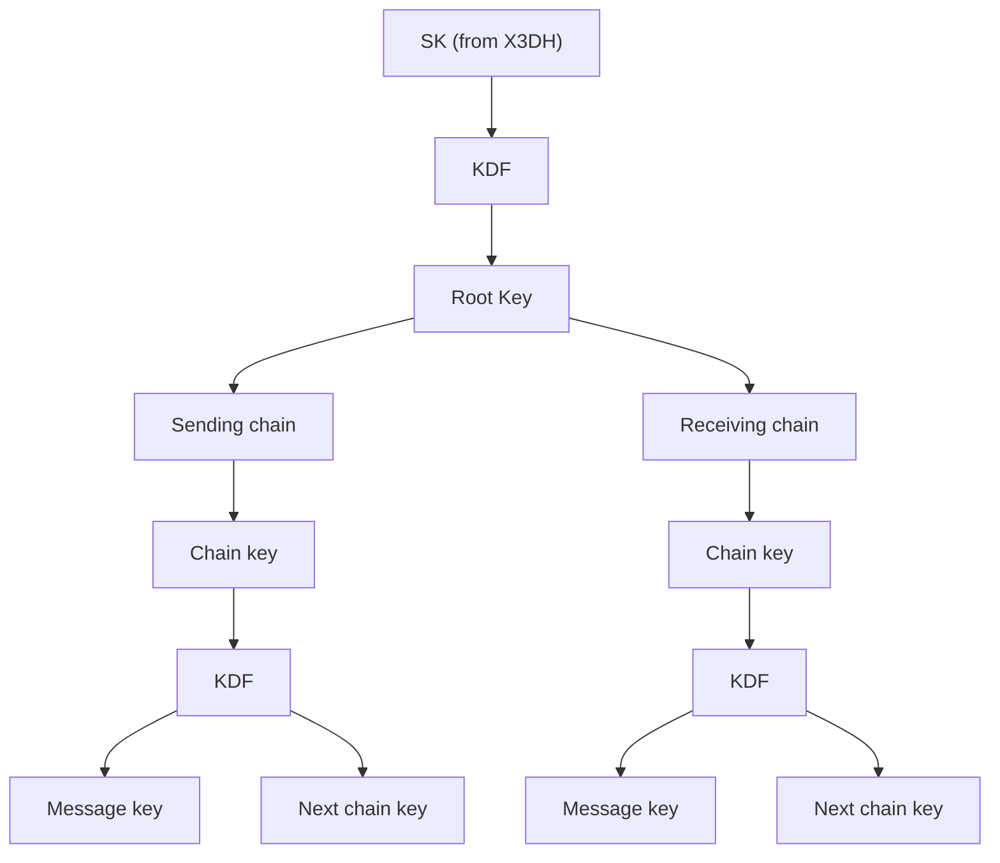

Why two chains? Alice has a **sending chain** (keys she uses to encrypt) that matches Bob's **receiving chain**, and vice versa. Each direction of the conversation has its own key stream.

---

## 11. Step 9: Symmetric ratchet and DH ratchet

The "double" in Double Ratchet is two ratchets running together.

### Ratchet 1: Symmetric-key ratchet (every message)

For each message:

1. Take the current **chain key**.
2. Run it through a KDF/HMAC (in Signal: HMAC-SHA256 with different constants).
3. Output a **message key** (used once) and the **next chain key**.
4. Delete the old chain key and, after use, the message key.

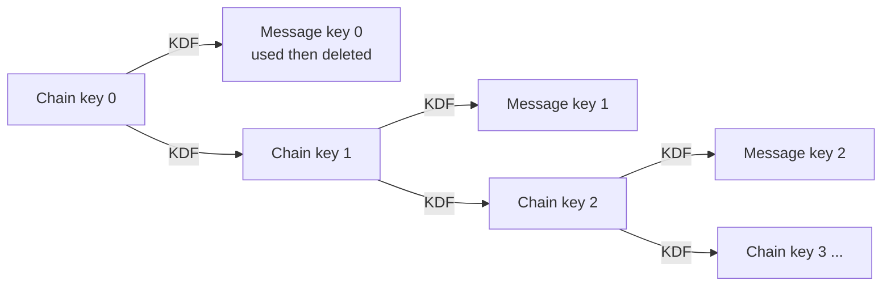

**Result: forward secrecy.** A KDF is one-way. If an attacker steals chain key 3 today, they cannot go backwards to recover message keys 0-2, and those were already deleted.

### Ratchet 2: Diffie-Hellman ratchet (periodically)

Whenever the conversation changes direction (you reply to someone), a new DH key pair is exchanged:

1. The sender generates a **new ratchet key pair** and attaches the public part to the message.
2. The receiver does `DH(own private, new public)` to get new entropy.
3. That output is mixed into the **root key** via KDF, producing a **new root key + new chain keys**.

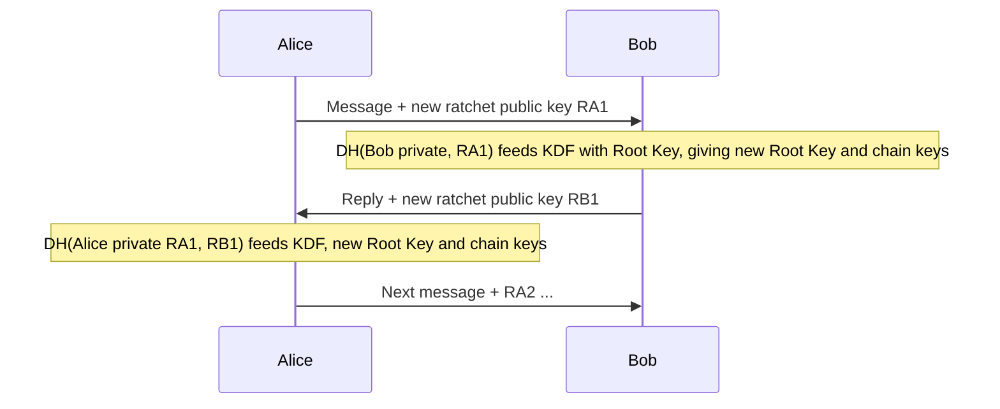

**Result: break-in recovery (post-compromise security).** Even if an attacker briefly steals all of a device's current keys, the next DH ratchet step injects fresh randomness the attacker does not have. The attacker is locked out again.

### Both ratchets together

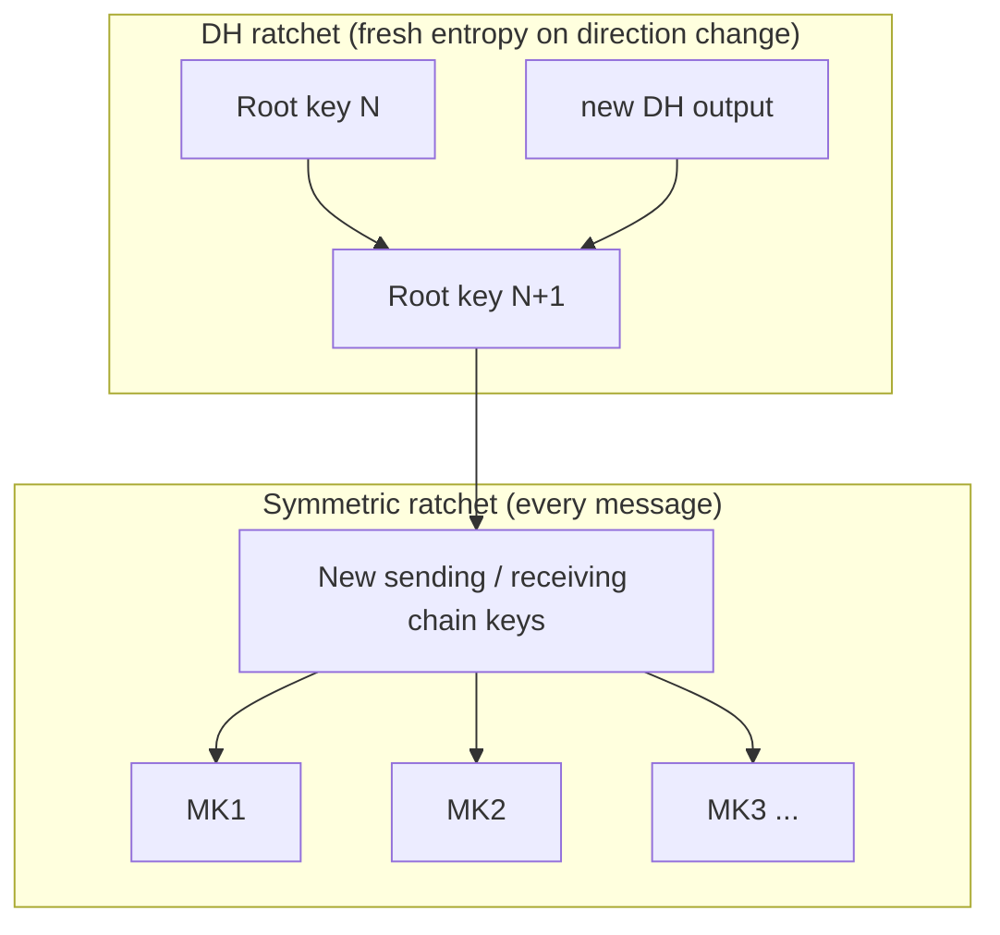

| Property | Provided by |
|---|---|
| Forward secrecy (past messages stay safe) | Symmetric ratchet + deleting used keys |
| Post-compromise security (future messages recover) | DH ratchet |
| Unique key per message | Symmetric ratchet |

---

## 12. Step 10: Message encryption

To encrypt "Hello Bob", Alice's device:

1. Takes the **current message key (MK)** from her sending chain.
2. Encrypts the plaintext with an **authenticated encryption (AEAD)** scheme.
3. Attaches **associated data**: identity of both parties, counters, etc. This is authenticated (tamper-proof) but not hidden.

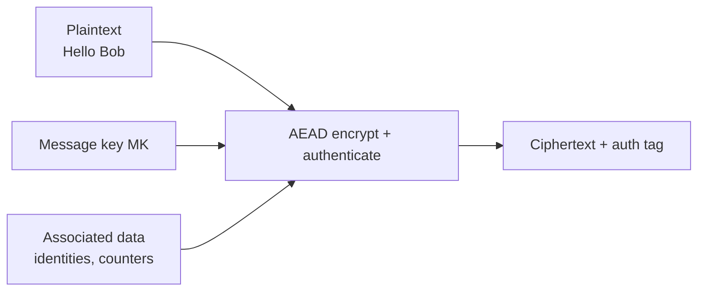

**What AEAD means:** one operation provides both **confidentiality** (nobody can read it) and **integrity/authenticity** (nobody can modify it undetected).

> Implementation note: the Double Ratchet specification describes AEAD abstractly. Signal's reference implementation (libsignal) in practice derives an AES-256 key, a MAC key and an IV from the message key, then uses **AES-256-CBC with HMAC-SHA256**. The security goal (encrypt + authenticate) is the same.

### Simplified message structure

| Field | Contents |
|---|---|
| Ciphertext | The encrypted message content |
| Ratchet info | Sender's current ratchet public key, message counter, previous chain length |
| Protocol metadata | Version, and (for first message) `IK_A`, `EK_A`, OPK id |

The ratchet info tells Bob **which key to use**, even if messages arrive out of order.

---

## 13. Step 11: The server's role

The WhatsApp server is a **relay**:

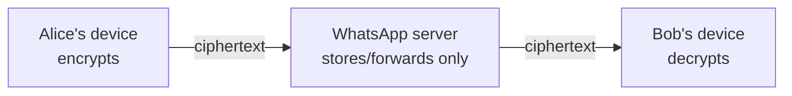

The server:

- Stores and distributes **public** keys (identity, signed prekey, one-time prekeys).
- Queues and forwards **ciphertext** when the recipient is offline.
- Cannot decrypt anything, because it never receives a private key, chain key or message key.

---

## 14. Step 12: Recipient decryption

Bob's device reverses the process:

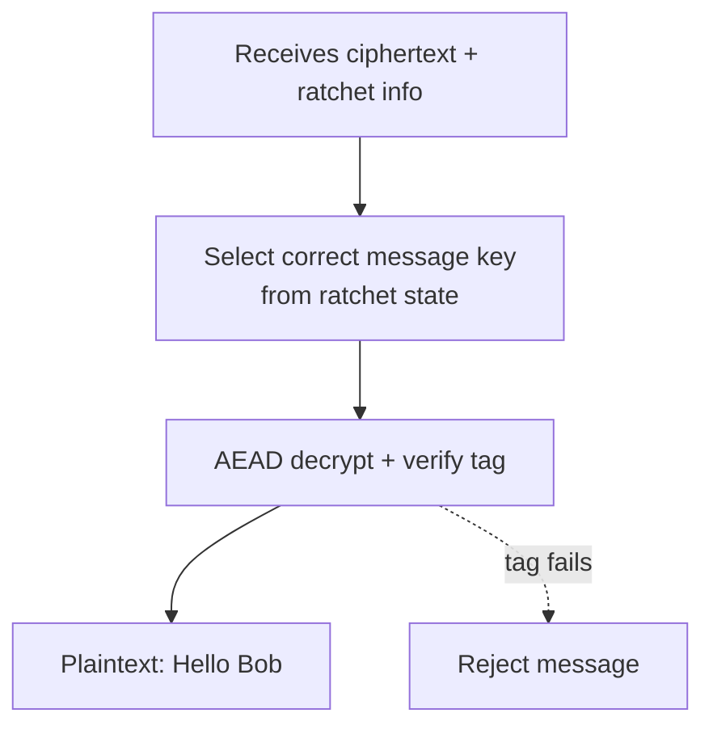

Details:

- **Selecting the key:** Bob uses the counter and ratchet public key in the message to find or derive the right message key.
- **Out-of-order messages:** if message 5 arrives before message 4, Bob advances his chain, **stores the skipped message keys** temporarily, and uses them when message 4 arrives. Then those keys are deleted.
- **Integrity check:** if anyone modified the ciphertext, the authentication tag fails and the message is dropped.
- WhatsApp never needs Bob's decryption key, because Bob already holds the matching ratchet state locally.

---

## 15. Group chats: Sender Keys

Pairwise encryption (Alice encrypts separately to each person) would be slow for large groups. Signal's **Sender Key** scheme makes it efficient.

### Setup (once per sender per group)

1. Alice generates a **Sender Key** for the group: a chain key and a signing key.
2. She sends that Sender Key to **each member individually**, using the normal 1-to-1 encrypted sessions.
3. Bob, Carol and David store Alice's Sender Key.

### Sending

1. Alice encrypts the group message **once** with a message key derived from her sender chain (the chain ratchets forward each message).
2. She signs it.
3. The server delivers the same ciphertext to everyone.
4. Each member uses the stored Sender Key to decrypt.

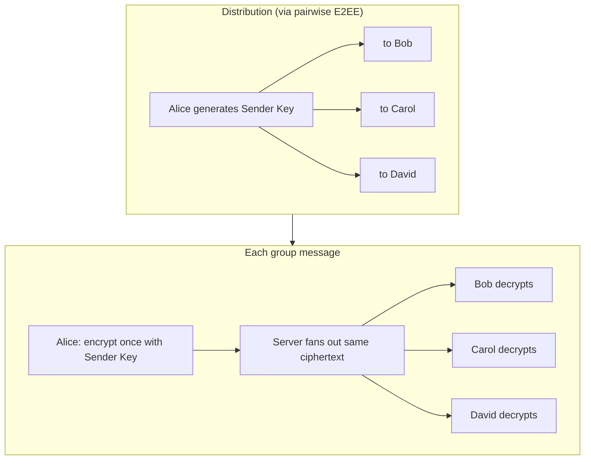

Every member has their own Sender Key for the group. When someone leaves the group, Sender Keys are regenerated so the departed member cannot read new messages.

**Trade-off:** sender keys are efficient, but they only ratchet forward (symmetric ratchet); they do not have the DH ratchet's break-in recovery. The pairwise channels used to distribute them do.

---

## 16. Media files

Photos, videos, voice notes and documents are large, so they are handled differently from text.

1. Sender generates a **random media encryption key** (plus a MAC key / IV).
2. Sender **encrypts the file locally** with it.
3. Sender uploads the **encrypted blob** to a media server.
4. Sender sends a normal E2EE message containing: the **download location/hash** and the **media key**.
5. Recipient downloads the encrypted blob, uses the key from the message to decrypt locally.

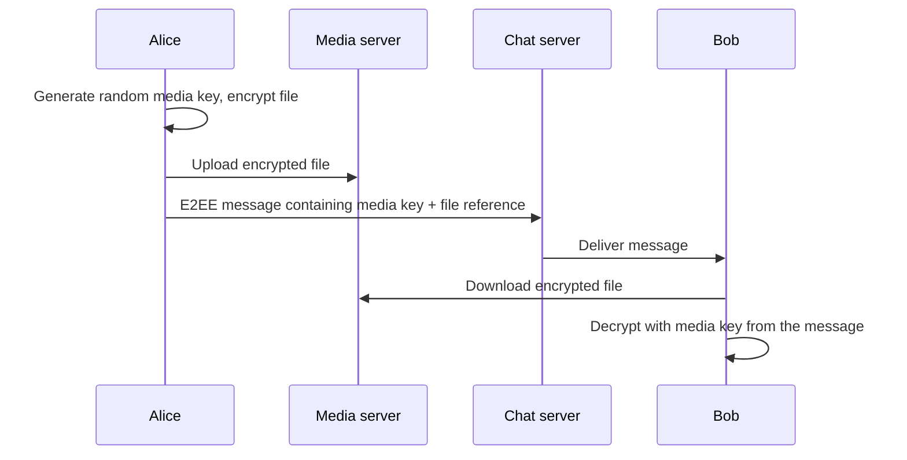

The media server only ever sees an encrypted blob. The key travels **inside the end-to-end encrypted message**, so it is protected by the Double Ratchet.

---

## 17. Calls

Voice and video calls use **SRTP** (Secure Real-time Transport Protocol).

1. The caller generates a random **32-byte SRTP master secret**.
2. It is sent to the callee **through the existing E2EE messaging channel**.
3. Both devices derive the actual audio/video encryption keys from the master secret and use SRTP for the media stream.

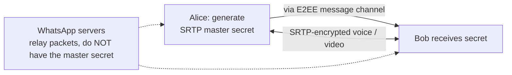

Servers may relay call packets (for connectivity), but they cannot decrypt them.

---

## 18. Encrypted backups

Chat history backups are a **separate layer**, and optional.

- By default, cloud backups (e.g. Google Drive / iCloud) are **not** protected by the live-message E2EE keys.
- With **end-to-end encrypted backups** turned on, the user sets a password or a 64-digit **backup encryption key**. The chat history is encrypted on the device before upload.
- The cloud provider then stores only encrypted data. Restoring requires the password/key.

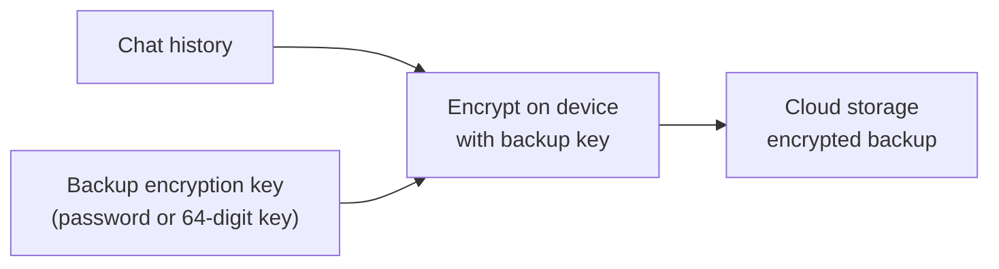

Important: backup encryption is **independent** of the Double Ratchet. If you do not enable it, the backup is protected only by the cloud provider's own security.

---

## 19. Security properties explained

| Property | Meaning | How it is achieved |
|---|---|---|
| Confidentiality | Only sender and recipient can read content | Encryption with message keys the server never has |
| Integrity | Messages cannot be modified undetected | AEAD / MAC tag |
| Authentication | You know who you are talking to | Identity keys, signed prekeys, security codes, Key Transparency |
| Forward secrecy | Stealing a key today does not expose past messages | Ephemeral keys, one-way KDF chains, deleting used keys |
| Post-compromise security (break-in recovery) | After a temporary compromise, security heals | DH ratchet injects fresh entropy |
| Asynchronous messaging | Start a chat while recipient is offline | Prekeys |
| Deniability | Messages cannot be cryptographically proven to a third party to come from you | Shared-key (MAC-based) authentication instead of per-message signatures in 1-to-1 chats |
| Replay resistance | Old messages cannot be re-sent as new | Counters + one-time prekeys + deleted message keys |

---

## 20. What the server and attackers can and cannot see

| Item | WhatsApp server | Network eavesdropper | Someone who steals your phone (unlocked) |
|---|---|---|---|
| Message content | No | No | Yes (current messages on device) |
| Public keys | Yes | Yes | n/a |
| Private keys | No | No | Yes |
| Past message keys | No | No | No (deleted by ratchet) |
| Metadata (who, when, sizes) | Largely yes | Partly | n/a |
| Media content | No (encrypted blob) | No | Yes (on device) |

**Limits of E2EE:** it protects content in transit and at the server. It does not protect against malware on your device, someone reading your unlocked screen, unencrypted cloud backups, or metadata like who messaged whom and when.

---

## 21. Full end-to-end flow (one diagram)

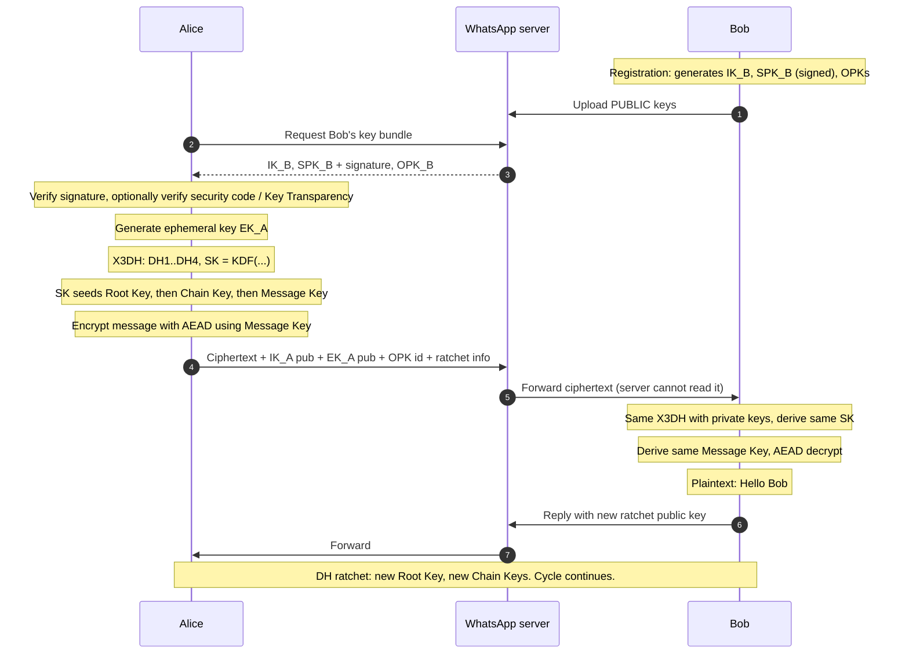

---

## 22. The 6 layers: viva / exam summary

| Layer | Name | One-line explanation |
|---|---|---|
| 1 | **Identity** | Long-term device identity keys: who you are cryptographically. |
| 2 | **Prekeys / asynchronous session establishment** | Pre-published keys let messaging start while the recipient is offline. |
| 3 | **Initial key agreement (X3DH)** | Four Diffie-Hellman calculations plus a KDF produce a shared secret nobody transmitted. |
| 4 | **Double Ratchet** | Symmetric ratchet (new key per message) + DH ratchet (fresh entropy) give forward secrecy and break-in recovery. |
| 5 | **Message encryption** | AEAD encrypts and authenticates each message with its own message key. |
| 6 | **Multi-device, group, media, call encryption** | Client-side fan-out per device, Sender Keys for groups, random keys for media, SRTP master secret for calls. |

```mermaid
flowchart TB
    L1["1. Identity<br/>long-term device keys"] --> L2["2. Prekeys<br/>async session setup"]
    L2 --> L3["3. X3DH<br/>four DH + KDF"]
    L3 --> L4["4. Double Ratchet<br/>symmetric + DH, forward secrecy"]
    L4 --> L5["5. Message encryption<br/>AEAD with message keys"]
    L5 --> L6["6. Multi-device / Group / Media / Calls<br/>client-side fan-out, Sender Keys, SRTP"]
```

---

## 23. Likely questions and answers

**Q1. Does WhatsApp ever have the keys to read my messages?**
No. Private identity keys, ratchet keys, chain keys and message keys exist only on the end devices. The server holds only public keys and ciphertext.

**Q2. Why do we need both identity keys and ephemeral keys?**
Identity keys prove who each party is. Ephemeral keys make each session setup unique and give forward secrecy. Mixing both in X3DH gives authentication plus forward secrecy.

**Q3. What is the purpose of one-time prekeys?**
They add fresh, single-use randomness to the first handshake and help prevent replay. Each is consumed once and deleted.

**Q4. What is the difference between the root key, chain key and message key?**
Root key: top-level, updated by DH ratchet steps. Chain key: advances once per message in one direction. Message key: used for exactly one message then deleted.

**Q5. What is forward secrecy and how is it achieved?**
Compromise of today's keys does not reveal yesterday's messages. Achieved by ephemeral keys, one-way KDF chains, and deleting used message keys.

**Q6. What is post-compromise security?**
After a temporary key compromise, the conversation becomes secure again once a new DH ratchet step occurs, because fresh entropy is mixed into the root key.

**Q7. How can Bob decrypt messages that arrive out of order?**
Ratchet info (counter, previous chain length, ratchet public key) lets Bob skip ahead, store the skipped message keys, and use them when delayed messages arrive.

**Q8. How are group messages encrypted efficiently?**
Each member distributes a Sender Key to the others over pairwise E2EE channels. Group messages are then encrypted once with that sender's chain and fanned out by the server.

**Q9. Are media files and calls also end-to-end encrypted?**
Yes. Media uses a random key that travels inside the E2EE message; calls use an SRTP master secret that is also exchanged through the E2EE channel.

**Q10. Are chat backups E2EE?**
Only if the user enables encrypted backups. Then the chat history is encrypted on-device with a separate backup key. Without it, backup protection depends on the cloud provider.

**Q11. How do I know nobody is intercepting my chat?**
Compare the **security code** with your contact. Key Transparency also helps detect unauthorized key substitution.

**Q12. What does E2EE not protect?**
Metadata, compromised devices, screenshots/shoulder surfing, and unencrypted backups.

---

*Same result, different devices, same security. Your messages, your keys.*
